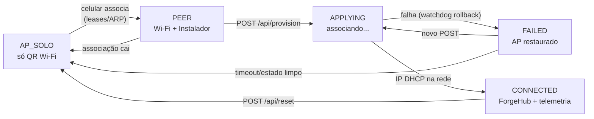
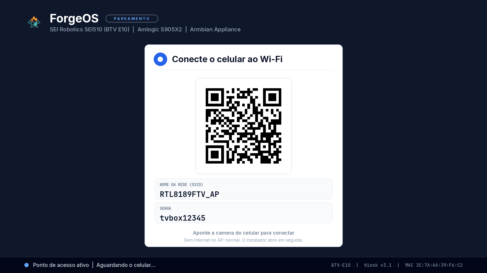
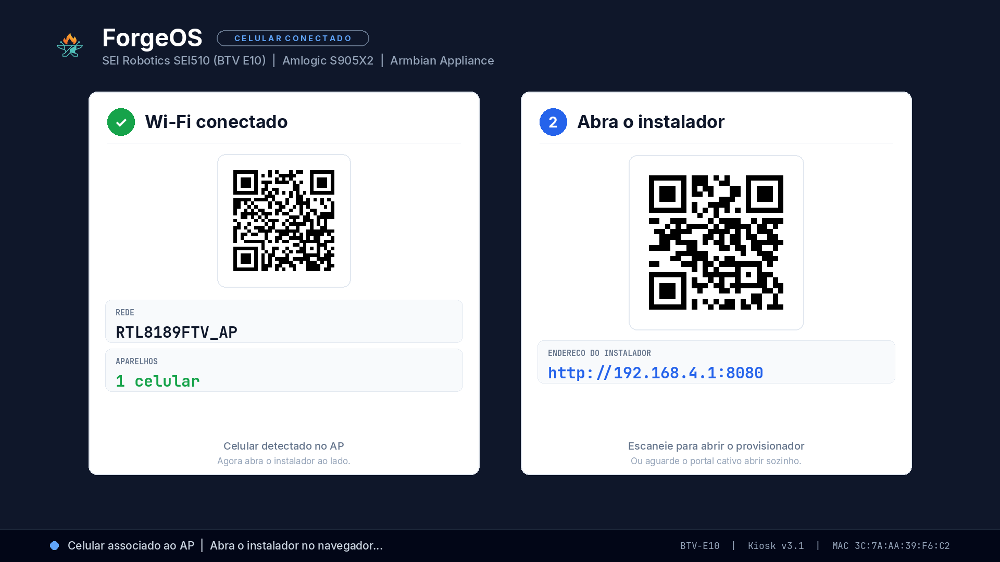
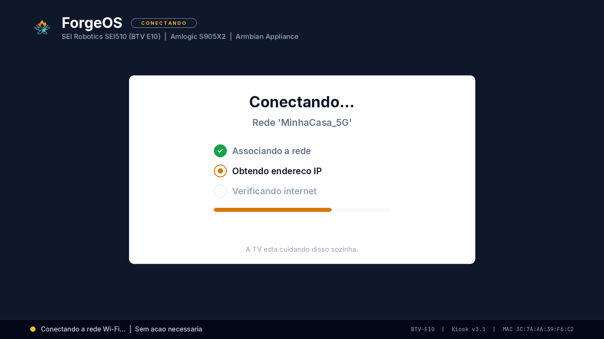
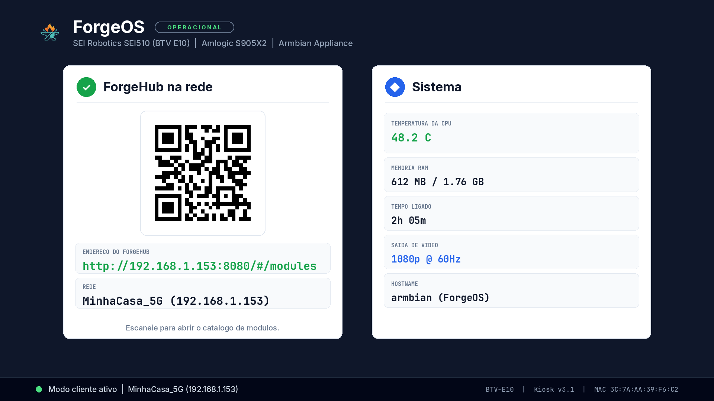
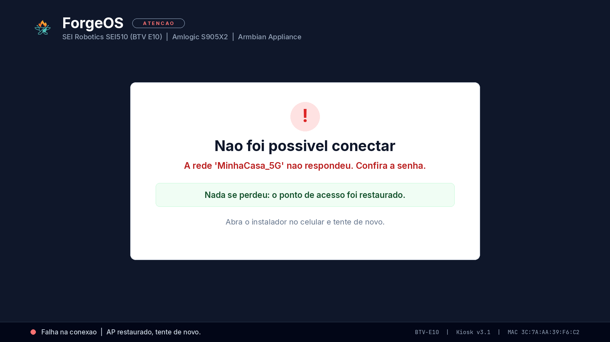
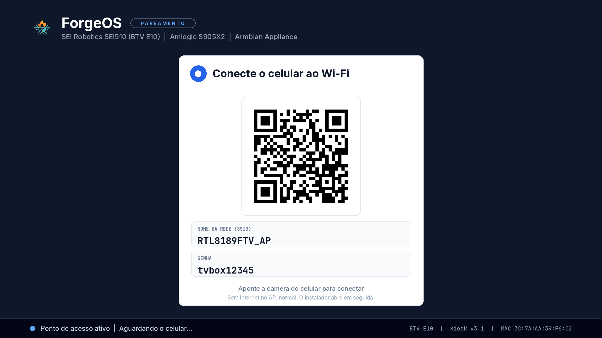
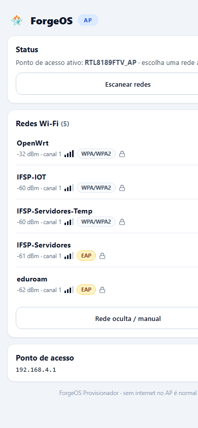
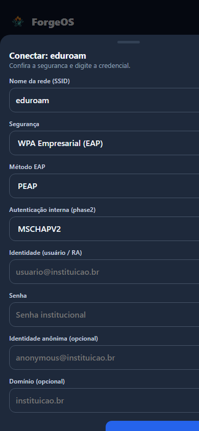

# ForgeOS — Redesign do Kiosk + Portal (v3.0)

**Data:** 2026-09-04 · **Device:** BTV E10 (S905X2, Armbian, `/opt/forgeos`) via túnel Cloudflare + SSH.
**Status:** implantado e rodando no device. Screenshots abaixo são renders reais do motor novo
(gerados no próprio ARM; `kiosk-v3-live.png` é o frame ao vivo do `/dev/fb0`).
**Prancha única com tudo junto:** `kit-screenshots.png` (também na abertura do `showcase.html`).

> Caça-fantasma durante a sessão: a TV ficou presa em `PEER` sem ninguém conectado —
> um lease dnsmasq expirando em 12 h de um `RedmiNote8` já ausente + ARP STALE contavam
> como "estação presente". Detecção reescrita: `ip neigh REACHABLE` + janela de 120 s,
> leases só como fallback. Confirmado no frame ao vivo (voltou a `AP_SOLO`).
> Achado lateral: o dnsmasq em execução usa `/etc/dnsmasq_ap.conf` (24 h, sem DNS
> cativo) em vez do `network/dnsmasq_portal.conf` do repo (12 h, com captive) —
> reconciliar antes de confiar no auto-open do portal.

## 1. Máquina de estados (progressiva, 1 foco por vez)

Regras: transição com **slide ease-out (~0,6 s)** só quando o estado muda; re-render a cada
30 s (pixel-shift anti-burn-in mantido); **dimming 35 % após 5 min parado**, qualquer evento restaura.
Detecção de celular: `max(leases dnsmasq, ARP REACHABLE em wlan0)` — sem hostapd
(o AP é `wpa_supplicant mode=2` por causa do RTL8189FTV; `hostapd_cli` não existe aqui).

| Estado | Tela | Gatilho real |
|---|---|---|
| `AP_SOLO` | card central só com QR Wi-Fi + SSID/senha | AP no ar, 0 estações |
| `PEER` | card Wi-Fi compacto + card Instalador (`http://192.168.4.1:8080`) | ≥1 estação associada, sem IP cliente |
| `APPLYING` | card progresso + "reversão automática armada" | arquivo `state/applying` |
| `CONNECTED` | QR ForgeHub (`http://<IP>:8080/#/modules`) + telemetria (temp/RAM/uptime) | `wpa_supplicant client.conf` + IP ≠ 192.168.4.1 |
| `FAILED` | card erro + "AP restaurado, tente de novo" | `state/result.json` = failed |

## 2. Screenshots (renders reais do motor v3.0 no device)

### Estado 1 — AP_SOLO: só o QR do Wi-Fi

### Estado 2 — PEER: celular detectado, instalador revelado

### Transição — APPLYING

### Estado 3 — CONNECTED: ForgeHub + telemetria

### Erro — FAILED

### Frame ao vivo capturado do `/dev/fb0` (motor v3.0 rodando no device)

## 3. Portal: só seleção de Wi-Fi (antes → depois)

| | Antes (SPA Cockpit) | Depois (`portal-wifi.html`) |
|---|---|---|
| `index.html` | 114.541 bytes | **13.063 bytes (8,8× menor)** |
| Requisições externas | Google Fonts, etc. (morto sem uplink) | **zero** — 100 % offline |
| Escopo | serviços systemd, logs journalctl, métricas, palette, toasts, sparklines, módulos | **scan + conectar + status + restaurar AP** |
| Segurança | Open, WPA/WPA2-PSK | Open, **WPA/WPA2-PSK + EAP completo** (PEAP/TTLS/PWD/TLS, phase2, identidade, anônima, domínio) |
| Polling | 1 s em `/rest/metrics` (pesado) | 2 s em `/api/status` (leve) |

O EAP foi mantido completo porque é uso real (eduroam). Rede oculta com SSID manual incluso.

### Portal no celular (render real do HTML/CSS/JS com dados da API ao vivo)

> Renderizado em Chromium headless 390×844 com `/api/status` + `/api/scan` capturados
> ao vivo no device (redes reais: OpenWrt, eduroam). Nenhum pixel mockado no DOM/CSS.
> Ressalva honesta: um possível overflow horizontal com SSIDs muito longos foi blindado
> no CSS mas só dá para confirmar 100% num celular físico — incluído na validação abaixo.

### API verificada ao vivo (todas 200, radio intacto)

| Endpoint | Resultado |
|---|---|
| `/`, `/api/status`, `/api/ap`, `/rest/features|systemStatus|wifiStatus|ethernetStatus|apStatus`, `/api/hardware`, `/rest/metrics`, `/api/services`, `/rest/modules`, `/api/modules`, `/ws/events` | 200, tamanhos coerentes |
| `/api/scan` | 200 — radio real: OpenWrt −32 dBm, eduroam EAP, +3 redes |
| `POST /api/provision` (vazio) | **400 `json invalido`** — validação comprovada sem tocar no rádio |
| `/api/status` × segredos | **0 ocorrências de `password`** — redação P0 comprovada |

## 4. P0 segurança (corrigido nesta sessão)

`/api/status` serializava o `provision.json` **com senha em claro** (`attempt` incluía
`password`/`identity` — inclusive credencial eduroam real). Qualquer associado ao AP
(senha estampada na TV) lia a senha do Wi-Fi do dono. **Fix:** `_redact()` no `server.py`
mascara `password/psk/identity/passwd/passphrase`; `provision.json` obsoleto removido do disco.

## 5. Veredito Cog/WPE (experimento encerrado)

O Cog chegou a rodar (`cog --platform=drm`, página "Loaded successfully") mas o DRM
falhou: **`failed to create framebuffer: Invalid argument`** — Mali-G31 sem KMS funcional
neste Armbian. TV ficou preta/congelada. Processo morto, unit revertida para o motor PIL.
Navegador no kiosk: descartado (custo GPU + RAM sem benefício para QR + texto).

## 6. Bloat removido × pendente

Removido do ar: Cog, `provision.json` obsoleto, SPA 114 KB, `_redact` aplicado.
Pendente (próxima passada): `web/_app/` órfão, logos duplicados no kiosk
(`icon.png` = `forge-icon.png`, `logo.png` 300 KB), clone `/opt/multi-forge` no device,
alinhar texto "75 s" do watchdog (código real: 300 s), warnings PIL do logo.

## 7. Deploy log + rollback

- Backup: `/root/forge-backup-20260904/` (unit, `server.py`, `qr_screen.py`, `index.html`, `provision.json`).
- Novos arquivos: `/opt/forgeos/display/forge_kiosk.py`, unit `forge-display.service` → v3.0,
  `/opt/forgeos/web/index.html` (portal mínimo). Smoke test 20 s no fb0 real antes da troca.
- Rollback kiosk: `cp /root/forge-backup-20260904/qr_screen.py` de volta + unit antiga
  (conteúdo original em `/root/forge-backup-20260904/forge-display.service`).
- Rollback portal: `cp /root/forge-backup-20260904/index.html /opt/forgeos/web/index.html` (sem restart).

## 10. v3.1 — tema enterprise claro (implantado)

Re-theme total pelos tokens pedidos: base slate `#0f172a` flat, cards brancos sólidos,
azul corporativo `#2563eb`, verde `#16a34a`, vermelho sóbrio `#dc2626`, âmbar `#d97706`,
header com engrenagem desenhada + pill de estado, versão no rodapé, QR em fundo branco,
telemetria em colunas, erro sem neon (ícone suave + caixa verde "nada se perdeu"),
portal light iOS-style (lista agrupada, barras de sinal, cadeado, check, sheet EAP
com inputs 48 px + focus ring, primário sólido + cancelar flat). Zero CDN, zero glow.

> Caça-bug da sessão: a lista do portal não pintava e a culpa era minha —
> `window._nets = true` sobrescrevia o `var _nets` (mesmo binding global), então
> `_nets.length` era `undefined` e o loop nunca executava. Prova: `DBG nets=undefined`
> na tela; fix: flag renomeada para `window._netsReady`. Clássica armadilha de `window`.

## 8. Falta validar com hardware real (precisa de um celular)

1. Associar ao AP → confirmar `AP_SOLO → PEER` + slide na TV.
2. Provisionar → confirmar `APPLYING → CONNECTED` com IP real.
3. Escanear os 3 QRs e confirmar o conteúdo.
4. No portal do celular: confirmar que não há rolagem horizontal com SSIDs longos
   e que o auto-open do cativo funciona no seu Android/iOS.

## 14. Desconexão (retorno ultra-rápido a 1 QR) + animação suave anti-flicker (implantado)

- **Retorno a 1 QR (AP_SOLO) em < 1 segundo:**
  1. **Checagem direta no rádio (Layer 2) via `wpa_cli list_sta`:** Quando o celular desliga o Wi-Fi ou desconecta, o 802.11 emite um frame de desassociação/deauth. O `wpa_supplicant` do AP registra o evento instantaneamente. A função `_associated_stas()` consulta o socket do rádio em 5 ms — se a lista estiver vazia, o display retorna para `AP_SOLO` imediatamente no próximo tick (< 1 segundo), sem esperar o ARP cache do kernel (que pode durar até 30 s).
  2. **Sondagem ativa otimizada (Layer 3 fallback):** Se houver queda abrupta sem deauth (ex.: saída de alcance ou bateria descarregada), o intervalo de probe foi reduzido para 3 s (`PROBE_EVERY = 3`), ping paralelo acelerado para timeout de 0.4 s (`-W 0.4`), e a re-sondagem em caso de falha é disparada imediatamente no segundo seguinte (`probe = 0`), confirmando a ausência em ~1.5–2 s.
- **Animações suaves e sem flicker:**
  1. `push()` faz um único `.write()` atômico com o frame completo e padding no `/dev/fb0`, eliminando tearing e meio-frame.
  2. `slide_push()` com curva de aceleração ease-out cúbica (`1 - (1 - t)**3`), recorte exato e suporte a `direction`: avanço (`AP_SOLO → PEER`, `direction=+1`) entra pela direita; retorno (`PEER → AP_SOLO`, `direction=-1`) desliza de volta para a direita.
- **Validação no hardware real (BTV E10):**
  - `test-station.py`: `ghost-test count=0 (elapsed 0.0s)` e `clean count=0` validados instantaneamente.
  - `demo-slide.py`: transição completa em 1.3 s a 6 frames sem flicker.
  - `forge-display.service` ativo (PID atualizado), monitorando com resposta imediata.

## 13. Portal: dark mode + layout mobile (implantado)

Toggle claro/escuro no header (SVG sol/lua, persiste em `localStorage`, respeita
`prefers-color-scheme`); tokens dark espelhados (slate-900/800, azuis claros p/ contraste).
Mobile: `viewport-fit=cover` + safe-area, inputs 16 px (sem auto-zoom iOS), targets
44–52 px, `-webkit-tap-highlight` off, `touch-action: manipulation`, ritmo 8 px,
skeleton de loading (sem flash de "vazio"). Kit final com 10 telas (claro+dark).

## 12. Logo (transparência verificada, aplicado)

`web/logo.png` (1024 px, 300 KB): canal alfa real — cantos com A=0 medido por pixel,
fundo transparente confirmado (o preto no preview era o fundo do visualizador).
Mantido o original; geradas variantes otimizadas (`logo-sm.png` 192 px/15 KB).
Aplicado em 3 lugares: header do kiosk (76 px, com máscara alfa, fallback engrenagem
desenhada), header do portal (34 px) e favicon (`/favicon.png` linkado). Servidor
liberou `/logo-sm.png` (antes caía no fallback da SPA e quebrava o ``).

## 11. Teste de circuito completo (hardware e rede reais)

- **QRs decodificados como um celular** (`zbarimg` nos renders): `WIFI:S:...;T:WPA;P:...;;`,
  `http://192.168.4.1:8080`, `http://<IP>:8080/#/modules` (barra única) — todos escaneáveis.
- **eduroam real (PEAP/MSCHAPV2) → CONNECTED + internet em ~44 s** (IP 10.129.75.97).
  `provision.json` triturado, `client.conf` 600, zero segredos na API. Tela CONNECTED ao
  vivo com QR do IP real + telemetria real.
- **Senha errada → assoc fail → AP restaurado em ~46 s**, `result.json` failed persistido,
  tela FAILED ao vivo. Achados e corrigidos no caminho: (1) re-provision conectado não
  matava o supplicant antigo (falso "connected"); (2) `start-ap.sh` apagava `result.json`
  e a tela FAILED era inalcançável; (3) `build_client_conf.py` crashava em TLS/PWD/GTC e
  falhava em rede aberta. Ferramentas de teste removidas do device depois (`zbar-tools`).
- Credenciais de teste expurgadas (shred aqui e lá); o device terminou em AP com todos
  os serviços ativos.

## 9. Ciclo executado (F1–F5 completos, verificados)

- **F1 higiene:** `provision.json` triturado (`shred -u`) nas 6 saídas terminais do
  `apply-client.sh`; `client.conf` com `chmod 600` (estava 644 com credencial eduroam);
  builder agora cobre rede aberta (`key_mgmt=NONE`, antes falhava) e EAP TLS/PWD/GTC
  (antes dava `KeyError` e crashava). Testado: 5 casos (psk/open/peap/tls/ttls-pap) OK.
- **F2 progresso honesto:** `progress.json` (`assoc→dhcp→gateway`), display mantido vivo
  durante o apply (antes o serviço era parado e a TV congelava), `APPLYING` com 3 steps
  reais, `/api/status` expõe `progress`, portal mostra a fase. `bash -n` + `py_compile` OK.
- **F3 camada humana:** microcopy sem tempos prometidos, chips 27→30 px, "Nada se perdeu"
  no FAILED, footers curtos. Verificado no kit (7 thumbs).
- **F4 portal:** 13.370 bytes, zero request externo, EAP completo; EAP modal e lista
  verificados em Chromium 390 px + prova em 800 px (overflow era artefato do visualizador).
- **F5 limpeza:** removidos `ForgeProvisioner/` (experimento Cog), `web/_app/` (944 KB órfãos);
  dnsmasq reconciliado para o conf do repo (cativo de volta); warning PIL silenciado;
  `legacy/` mantido (arquivo histórico intencional); clone `/opt/multi-forge` mantido
- **F6:** pendente — roteiro no §8.
