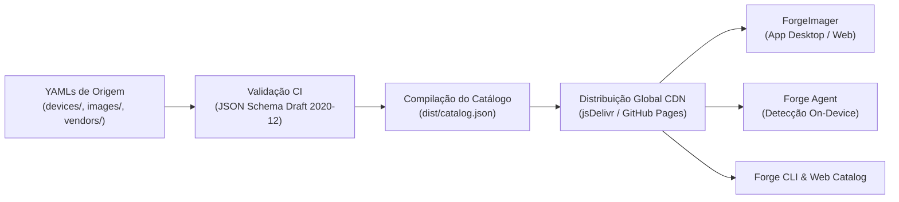

# ForgeDB

[](#dispositivos-homologados)
[](schemas/)
[](../LICENSE)
[](https://github.com/multi-forge/multi-forge/actions)

Base de dados centralizada, declarativa e versionada contendo especificações completas de hardware, assinaturas de impressão digital (fingerprints), matriz de inicialização (Device Tree / bootloader), catálogo de imagens de sistema operacional e manifesto de módulos do ecossistema **MultiForge**.

---

## Como Funciona o ForgeDB

O ForgeDB utiliza um pipeline automatizado de compilação contínua:



1. **Fonte Declarativa (YAML)**: Mantenedores e comunidade definem placas, imagens e fabricantes em arquivos YAML legíveis e versionados no Git.
2. **Validação & Compilação (CI)**: A cada commit ou pull request, o pipeline do GitHub Actions valida todos os arquivos contra schemas formais JSON Schema Draft 2020-12 e compila os dados em um arquivo unificado `dist/catalog.json`.
3. **Distribuição via CDN**: O catálogo compilado e as imagens são distribuídos globalmente via CDN com cache e alta disponibilidade.
4. **Consumo por Clientes**: Ferramentas como o **ForgeImager**, o agente de detecção **Forge Agent** e a CLI consomem o endpoint para autodeteção de hardware e gravação de imagens.

---

## Estrutura do Repositório

```text
ForgeDB/
├── devices/             # Metadados de placas e SBCs homologadas por fabricante
│   └── btv/
│       └── e10/
│           ├── device.yaml    # Especificação v2 de hardware, fingerprints e boot
│           ├── images.yaml    # Catálogo de imagens de SO disponíveis
│           ├── dtb/           # Binários de Device Tree (.dtb)
│           └── photos/        # Fotos da placa (PCB) e carcaça
├── vendors/             # Perfis dos fabricantes de hardware
│   └── btv.yaml         # Metadados do fabricante (BTV)
├── modules/             # Catálogo e manifestos de aplicações do ecossistema
│   ├── catalog.yaml     # Índice central de módulos
│   ├── totem/           # Módulo Mina AI Totem
│   └── web-scraping/    # Módulo Coletor / RAG
├── schemas/             # Schemas JSON formais (Draft 2020-12)
│   ├── device.schema.json   # Validador de device.yaml (v2)
│   ├── image.schema.json    # Validador de images.yaml
│   ├── catalog.schema.json  # Validador do catálogo compilado (dist/catalog.json)
│   ├── vendor.schema.json   # Validador de vendors/*.yaml
│   └── module.schema.json   # Validador de module.yaml
├── dist/                # Saída compilada para produção
│   └── catalog.json     # Catálogo consolidado gerado pelo CI
├── CONTRIBUTING.md      # Guia completo para adicionar novos dispositivos
└── README.md
```

---

## Endpoints da API / CDN

O catálogo compilado pode ser consumido diretamente por qualquer cliente HTTP:

| Recurso | URL |
| :--- | :--- |
| **Catálogo Global (jsDelivr CDN)** | `https://cdn.jsdelivr.net/gh/multi-forge/multi-forge@main/ForgeDB/dist/catalog.json` |
| **Catálogo Global (GitHub Raw)** | `https://raw.githubusercontent.com/multi-forge/multi-forge/main/ForgeDB/dist/catalog.json` |
| **Schema do Dispositivo** | `https://raw.githubusercontent.com/multi-forge/multi-forge/main/ForgeDB/schemas/device.schema.json` |
| **Schema de Imagens** | `https://raw.githubusercontent.com/multi-forge/multi-forge/main/ForgeDB/schemas/image.schema.json` |
| **Schema do Catálogo** | `https://raw.githubusercontent.com/multi-forge/multi-forge/main/ForgeDB/schemas/catalog.schema.json` |
| **Schema de Fabricantes** | `https://raw.githubusercontent.com/multi-forge/multi-forge/main/ForgeDB/schemas/vendor.schema.json` |

---

## Especificações dos Schemas (v2)

### 1. Descritor de Dispositivo (`device.yaml`)
Define a identidade do dispositivo, hardware, parâmetros de boot e a seção de **fingerprints** (impressões digitais de hardware para autodeteção):

```yaml
schema: forgedb/v2
id: btv-e10
slug: btv-e10
name: "BTV Express E10"
manufacturer: btv
category: tv-box
status: supported
description: "TV Box ARM64 com Amlogic S905X2, 2GB LPDDR4, 8GB eMMC, Wi-Fi RTL8189FTV SDIO"

hardware:
  soc:
    vendor: Amlogic
    model: S905X2
    family: meson-g12a
    architecture: arm64
    cores: 4
    cpu: Cortex-A53
    max_freq_mhz: 1800
  memory:
    ram: 2GB
    storage: 8GB
    storage_type: emmc
  wireless:
    wifi: RTL8189FTV
    wifi_bus: sdio
    bluetooth: null
  ports:
    usb2: 1
    usb3: 1
    hdmi: 1
    ethernet: 1
    sd_card: false
    av: true

fingerprints:
  cpuinfo:
    hardware: "Amlogic"
    cpu_family: "g12a"
    serial_prefix: null
  device_tree:
    compatible:
      - "btv,e10"
      - "seirobotics,sei510"
      - "amlogic,g12a"
    model: "BTV Express E10*"
  usb:
    - vid: "1b8e"
      pid: "c003"
      description: "GX-CHIP*"
  storage_model:
    patterns:
      - "*S905X2*"
      - "*BTV*E10*"
      - "*SEI510*"
  pcb_markings:
    - "BTVE E10-LPDDR4 V.10 201-03-08"
    - "BTVE E10-LPDDR4 V.11"

boot:
  dtb: meson-g12a-btv-e10-enterprise.dtb
  dtb_fallback: meson-g12a-sei510.dtb
  aml_autoscript: true
  preferred_flash_tool: install-aml.sh
  recovery_method: maskrom-usb
  boot_media:
    - sd
    - emmc

known_issues:
  - title: "armbian-install incompativel"
    severity: medium
    description: "O script armbian-install padrao nao funciona neste hardware"
    workaround: "Usar install-aml.sh do ForgeOS"
```

### 2. Manifesto de Imagens (`images.yaml`)
Descreve as versões de sistema operacional homologadas, variantes (desktop, server, iot, minimal), versões de kernel, hashes SHA-256 e URLs de download:

```yaml
schema: forgedb-images/v1
device_id: btv-e10

images:
  - id: forgeos-btv-e10-desktop
    distribution: ForgeOS
    variant: desktop
    version: "1.0.0"
    kernel:
      branch: current
      version: "6.1.y"
    stability: stable
    recommended: true
    download:
      url: "https://github.com/multi-forge/multi-forge/releases/download/v1.0.0/forgeos-btv-e10-desktop.img.xz"
      sha256_url: "https://github.com/multi-forge/multi-forge/releases/download/v1.0.0/forgeos-btv-e10-desktop.img.xz.sha256"
      size_bytes: 524288000
      format: img.xz
    flash_target:
      - sd
      - emmc
```

### 3. Fabricantes (`vendors/*.yaml`)
Metadados sobre fabricantes e marcas de hardware:

```yaml
id: btv
name: "BTV"
logo_url: null
website: null
description: "Fabricante de TV Boxes para o mercado brasileiro"
country: "BR"
```

---

## Validação Local

Para verificar a conformidade dos arquivos antes de submeter alterações:

```bash
# Validar device.yaml
npx --yes js-yaml devices/btv/e10/device.yaml > temp_device.json
npx --yes ajv-cli validate --spec=draft2020 --strict=false -s schemas/device.schema.json -d temp_device.json

# Validar images.yaml
npx --yes js-yaml devices/btv/e10/images.yaml > temp_images.json
npx --yes ajv-cli validate --spec=draft2020 --strict=false -s schemas/image.schema.json -d temp_images.json

# Validar vendor.yaml
npx --yes js-yaml vendors/btv.yaml > temp_vendor.json
npx --yes ajv-cli validate --spec=draft2020 --strict=false -s schemas/vendor.schema.json -d temp_vendor.json
```

---

## Como Contribuir

Deseja homologar um novo dispositivo no ForgeDB? Consulte nosso guia detalhado passo a passo em [CONTRIBUTING.md](CONTRIBUTING.md).
