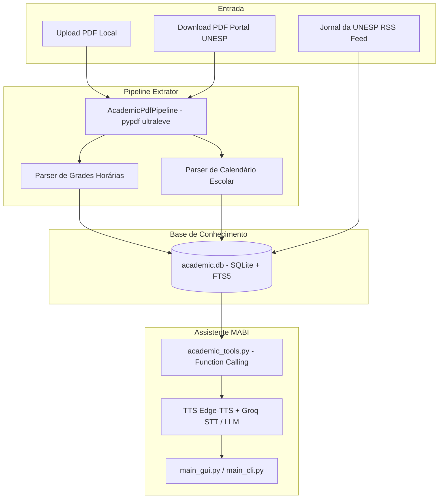

# 🎓 MABI / Mina — Módulo Standalone & Pipeline de Extração Acadêmica (UNESP Sorocaba)

Este repositório isolado contém a versão completa e homologada da **Mina (MABI)**, assistente virtual acadêmica projetada para quiosques/totens em TV Boxes (BTV E10 - ARM / 2 GB RAM), incluindo o **circuito completo de ingestão de PDFs**, integração com APIs da UNESP Sorocaba e consulta local offline-first.

---

## 🏗️ Arquitetura do Sistema



---

## 📂 Estrutura de Diretórios

```
mabi-standalone/
├── config/
│   ├── academic.db              # Banco SQLite oficial da UNESP Sorocaba
│   ├── academic_data.json       # Configuração base de fallback para docentes e salas
│   └── config.json              # Configurações de hardware, áudio e chaves de API
├── src/
│   ├── utils/
│   │   ├── academic_db.py       # Acesso e sincronização do banco local (atualizado)
│   │   ├── academic_tools.py    # Ferramentas de Tool Calling para a LLM
│   │   ├── chat_bridge.py       # Conexão com modelos de chat (Groq/Cerebras)
│   │   ├── pdf_extractor_service.py # 🚀 Extrator ultraleve de PDFs (grades e datas)
│   │   ├── stt_client.py        # Transcrição de áudio via Whisper/Groq
│   │   └── tts_client.py        # Síntese de voz com fallback
│   ├── display/                 # Telas e layouts QML/PyQt5
│   └── views/                   # Telas de ativação e configurações
├── tts_api/
│   ├── main.py                  # API FastAPI (TTS + Endpoints de Ingestão de PDF)
│   └── Dockerfile               # Container para execução isolada
├── scripts/
│   └── unesp_scraper.py         # Scraper RSS e seed do banco
├── tests/                       # Suíte de testes do módulo
├── main_cli.py                  # Interface de linha de comando da Mina
├── main_gui.py                  # Interface gráfica (Totem) da Mina
└── requirements.txt             # Dependências Python
```

---

## 🔌 Endpoints da API (`tts_api/main.py`)

A API unificada roda via FastAPI e disponibiliza tanto a síntese de voz quanto os endpoints de atualização da base acadêmica:

### 1. Ingestão de PDF via Upload de Arquivo
- **Rota:** `POST /academic/ingest-pdf`
- **Content-Type:** `multipart/form-data`
- **Parâmetros:**
  - `file`: Arquivo `.pdf`
  - `doc_type`: `"schedule"` (grade horária) ou `"calendar"` (calendário)
- **Exemplo com cURL:**
  ```bash
  curl -X POST "http://localhost:8000/academic/ingest-pdf" \
    -F "file=@horario_eca_2026.pdf" \
    -F "doc_type=schedule"
  ```

### 2. Ingestão de PDF via URL do Portal UNESP
- **Rota:** `POST /academic/ingest-pdf-url`
- **Content-Type:** `application/json`
- **Payload:**
  ```json
  {
    "url": "https://www.sorocaba.unesp.br/.../horario-de-aulas.pdf",
    "doc_type": "schedule"
  }
  ```
- **Exemplo com cURL:**
  ```bash
  curl -X POST "http://localhost:8000/academic/ingest-pdf-url" \
    -H "Content-Type: application/json" \
    -d '{"url": "https://www.sorocaba.unesp.br/documento.pdf", "doc_type": "schedule"}'
  ```

### 3. Síntese de Voz (TTS)
- **Rota:** `POST /synthesize` ou `GET /synthesize?text=Texto`
- **Retorno:** Áudio streaming em `audio/mpeg` (voz `pt-BR-FranciscaNeural`).

---

## 🚀 Como Executar

### 1. Pré-requisitos
- Python 3.10 ou 3.11 instalado.
- Instale as dependências:
  ```bash
  pip install -r requirements.txt
  pip install pypdf
  ```

### 2. Subir o Servidor da API
```bash
python -m uvicorn tts_api.main:app --host 0.0.0.0 --port 8000 --reload
```
Acesse a documentação interativa em: `http://localhost:8000/docs`

### 3. Iniciar a Mina (MABI)
- **Modo Terminal:**
  ```bash
  python main_cli.py
  ```
- **Modo Interface Gráfica (Totem TV):**
  ```bash
  python main_gui.py
  ```

---

## 🛠️ Manutenção e Testes

Para validar a integridade do banco de dados e de todas as ferramentas de consulta:

```bash
# Teste completo do circuito de PDF (em memória -> banco -> resposta da Mina)
python scratch/test_pdf_circuit_e2e.py

# Teste de regressão completo de todas as 79 queries do sistema acadêmico
python scratch/test_academic_db_full.py
```
