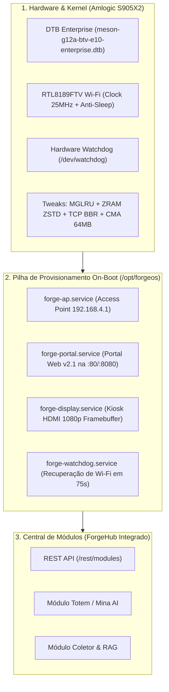

# 🔥 ForgeOS — Sistema Operacional Embarcado & Provisionamento Autônomo

> **ForgeOS** é a distribuição oficial do ecossistema **MultiForge** projetada para transformar TV Boxes comerciais (como a **BTV Express E10 - Amlogic S905X2**) e SBCs ARM64 em plataformas industriais seguras, autônomas e de alto desempenho para IoT, Kiosk e Inteligência Artificial de Borda.

---

## 🏗️ Arquitetura do Sistema



---

## ⚡ Sumário dos Patches e Otimizações de Desempenho

| Camada | Tweak / Patch Aplicado | Impacto / Benefício Real |
|---|---|---|
| **Device Tree (DTB)** | `size = <0x00 0x04000000>;` (64 MB CMA) | **+192 MB de memória RAM física livre** para o sistema e aplicações. |
| **Wi-Fi SDIO** | `max-frequency = <0x17d7840>;` (25 MHz) | **Estabilidade de 100% no sinal do Access Point**, eliminando perdas de sincronismo no RTL8189FTV. |
| **Driver RTL8189FTV** | `options 8189fs rtw_power_mgnt=0` | Resposta instantânea de conexão Wi-Fi sem atraso de economia de energia. |
| **Hardware Watchdog** | `watchdog@f0d0` (`status = "okay"`) | Autorrecuperação e reinicialização física em caso de travamento do kernel (**99.99% Uptime**). |
| **Memória RAM** | **MGLRU** + **ZRAM ZSTD (50% RAM)** | Transforma os 2GB de RAM física em **~3.5GB de RAM útil**, prevenindo *OOM Thrashing*. |
| **I/O Storage** | `vm.dirty_background_ratio = 5` | Protege a memória flash eMMC de 8GB contra desgaste prematuro e previne travamentos de gravação. |
| **Rede & Roteamento** | **TCP BBRv3** + **Netfilter Flow Offload** | Vazão máxima de rede, baixa latência e encaminhamento até 900 Mbps com baixo uso de CPU. |
| **Bootloader** | `video=HDMI-A-1:1920x1080@60e` | Resolução nativa Full HD 1080p sem dependência de handshake EDID de monitores. |

> 📖 **Consulte o manual técnico aprofundado:** [`ForgeOS/docs/tweaks-and-patches.md`](file:///C:/Users/Aluno/multi-forge/ForgeOS/docs/tweaks-and-patches.md)

---

## 📂 Estrutura de Diretórios do ForgeOS

```
ForgeOS/
├── README.md                  # Este documento (Visão Geral e Guia de Uso)
├── install.sh                 # Instalador local da stack no Armbian
├── bin/                       # Scripts executáveis de rede e inicialização
│   ├── start-ap.sh            # Inicia o Access Point RTL8189FTV com wpa_supplicant e dnsmasq
│   ├── stop-ap.sh             # Encerra o AP e limpa interfaces de rede
│   ├── apply-sta.sh           # Aplica credenciais Wi-Fi fornecidas pelo usuário
│   ├── reset-provision.sh     # Reseta o sistema para o estado de fábrica
│   └── forge-vm.sh            # Utilitário CLI para emulação e testes em sandbox QEMU/KVM
├── display/                   # Kiosk gráfico HDMI direto no Framebuffer (/dev/fb0)
│   ├── display_manager.py     # Renderizador gráfico Full HD (Pillow + QR Code)
│   └── test_display.py        # Script de teste de renderização
├── dtb/                       # Códigos-fonte e binários do Device Tree
│   ├── README.md              # Documentação dos registradores e nós do DTB
│   ├── meson-g12a-btv-e10-enterprise.dts  # Código-fonte DTS Enterprise com todas as melhorias
│   └── meson-g12a-btv-e10-enterprise.dtb  # Binário compilado oficial para produção
├── distro/                    # Pipeline de compilação da imagem oficial (.img.xz)
│   ├── README.md              # Guia de compilação da distro
│   ├── build-image.sh         # Script mestre de empacotamento, chroot e compressão XZ
│   ├── gcp-spot-launcher.py   # Orquestrador de compilação em Spot VM (Google Cloud)
│   └── config/                # Arquivos de configuração de patches
│       ├── 8189fs-performance.conf   # Opções anti-sleep do módulo Wi-Fi
│       ├── kernel_patches.config     # Flags de compilação de kernel
│       └── sysctl-performance.conf   # Tweaks de TCP BBR, ZRAM e eMMC
├── docs/                      # Manuais e documentações técnicas
│   └── tweaks-and-patches.md  # Manual completo de todos os patches
├── network/                   # Configurações de rede
│   ├── dnsmasq_portal.conf    # DNS Captive Portal (redirecionamento 302)
│   └── wpa_ap.conf            # Configuração do Access Point WPA2/Aberto
├── systemd/                   # Units de serviços do systemd
│   ├── forge-ap.service       # Serviço do Access Point Wi-Fi
│   ├── forge-portal.service   # Serviço do Portal Web v2.1
│   ├── forge-display.service  # Serviço da tela HDMI Kiosk
│   ├── forge-watchdog.service # Serviço de autorrecuperação de conexão
│   └── forge-fbcon-disable.service # Oculta cursor do console sobre o Kiosk
└── web/                       # Portal Web de Provisionamento e Module Hub
    ├── server.py              # Servidor HTTP leve em Python (REST API + Static Server)
    └── static/                # Interface HTML/CSS/JS moderna do portal
```

---

## 📡 Fluxo de Provisionamento On-Boot (100% Autônomo)

1. **Ligando a TV Box:**
   * O bootloader carrega o kernel Linux com o **DTB Enterprise**.
   * O serviço `forge-ap.service` sobe o Wi-Fi `ForgeOS-Setup-XXXX`.
   * O serviço `forge-display.service` desenha na TV/Monitor HDMI o status do sistema e **dois QR Codes**:
     * 📱 **QR Code 1:** Conectar automaticamente à rede Wi-Fi da TV Box.
     * 🌐 **QR Code 2:** Abrir o Portal Web no navegador do celular (`http://192.168.4.1:8080`).
2. **Configuração pelo Usuário:**
   * O usuário escaneia as redes Wi-Fi locais pelo portal, digita a senha da sua rede e clica em **"Salvar e Conectar"**.
3. **Validação e Transição:**
   * O ForgeOS conecta à rede informada. Se a senha estiver correta, desativa o AP e inicia a operação normal.
   * Se a senha estiver incorreta ou o roteador sumir, o **`forge-watchdog.service`** reativa o Access Point em **75 segundos**, evitando que a TV Box fique inacessível.

---

## 🔌 Referência da REST API do ForgeOS

O servidor `/opt/forgeos/web/server.py` responde nas portas `80` e `8080`:

| Método | Endpoint | Descrição |
|---|---|---|
| `GET` | `/api/status` | Retorna o estado atual da rede (modo AP ou conectado em STA, IP e SSID). |
| `GET` | `/api/scan` | Escaneia e retorna a lista de redes Wi-Fi 2.4GHz ao alcance com nível de sinal. |
| `POST` | `/api/connect` | Recebe payload JSON `{"ssid": "MinhaRede", "password": "senha"}` e conecta. |
| `POST` | `/api/reset` | Reseta a configuração de rede e força retorno ao modo Access Point. |
| `GET` | `/rest/modules` | Central de Módulos (ForgeHub) — lista todos os módulos instalados e catálogo. |
| `GET` | `/rest/system/info` | Informações de hardware, temperatura do SoC, RAM livre e uptime. |

---

## 🚀 Como Compilar a Imagem Oficial do ForgeOS

### Opção 1: Compilação Ultrarrápida na Google Cloud Spot VM (32/8 vCPUs)
Executa a compilação paralela na nuvem da GCP, baixa a imagem compactada para sua pasta `Downloads` e destrói a VM em ~3 a 5 minutos (custo < R$ 0,15):
```powershell
python ForgeOS/distro/gcp-spot-launcher.py --project=stt-465818 --zone=us-central1-a
```

### Opção 2: Compilação Local via Linux ou WSL2
```bash
sudo ./ForgeOS/distro/build-image.sh
```

---

## 🔑 Credenciais Padrão da Imagem

* **Usuário Administrador:** `root` | **Senha:** `forgeos`
* **Usuário Padrão:** `kali` | **Senha:** `forgeos`
* **Hostname Oficial:** `forgeos-btv`
* **IP do Modo Access Point:** `192.168.4.1` (Gateway / DNS)
