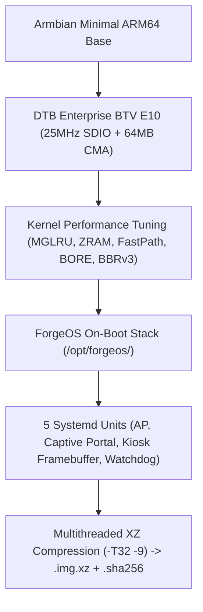

# 🛠️ ForgeOS Distro Build Pipeline (Amlogic S905X2 / BTV E10)

> Pipeline automatizado de compilação, otimização de kernel e empacotamento de distribuições oficiais bootáveis (.img.xz) para TV Boxes Amlogic S905X2.

---

## 🎯 Arquitetura da Imagem ForgeOS

A distribuição oficial do ForgeOS é construída a partir da base minimal **Armbian Trixie (Debian 13 ARM64)**, aplicando uma pilha completa de otimizações de nível empresarial e provisionamento autônomo no primeiro boot:



---

## ⚡ Patches de Kernel e Otimizações Aplicadas:

| Otimização | Parâmetro / Configuração | Impacto Prático |
|---|---|---|
| **MGLRU** | `CONFIG_LRU_GEN=y`, `CONFIG_LRU_GEN_ENABLED=y` | Gestão multigeracional de memória, previne *OOM thrashing* nos 2GB de RAM. |
| **ZRAM Multi-Stream** | `ALGO=zstd`, `PERCENT=50` | Transforma 2GB em ~3.5GB de RAM útil sem desgaste da eMMC. |
| **Software Fast-Path** | `CONFIG_NETFILTER_XT_TARGET_FLOWOFFLOAD=y` | Roteamento com bypass de pilha L3/L4, até 900 Mbps com baixo uso de CPU. |
| **BORE Scheduler** | `CONFIG_SCHED_BORE=y` | Prioriza rajadas curtas e interativas, mantendo SSH e daemons fluidos a 100% de CPU. |
| **Kyber I/O Scheduler** | `CONFIG_MQ_IOSCHED_KYBER=y` | Previne travamentos de I/O durante gravações pesadas na eMMC / MicroSD. |
| **TCP BBRv3** | `net.ipv4.tcp_congestion_control = bbr` | Vazão máxima e baixa latência em conexões de rede e túneis WireGuard. |
| **DTB Enterprise BTV E10** | `meson-g12a-btv-e10-enterprise.dtb` | Clock SDIO 25MHz estável para RTL8189FTV, 64MB CMA (+192MB RAM livre), Watchdog de hardware. |
| **Preempt 300Hz** | `CONFIG_HZ_300=y`, `CONFIG_PREEMPT=y` | Equilíbrio ideal de responsividade sem sobrecarregar os núcleos Cortex-A53. |
| **Wi-Fi Anti-Sleep** | `rtw_power_mgnt=0`, `rtw_enusbss=0` | Zero atraso no handshake WPA2 durante o provisionamento. |

---

## 🚀 Como Compilar:

### Opção 1: Compilação Ultrarrápida na Google Cloud Spot (32 vCPUs)
Suba uma VM efêmera de 32 vCPUs na GCP, compile em ~3 a 5 minutos e auto-destrua a VM:
```powershell
python ForgeOS/distro/gcp-spot-launcher.py --project=stt-465818 --zone=us-central1-a
```

### Opção 2: Compilação Local no WSL2 / Linux
Execute diretamente na sua máquina local Linux ou WSL2:
```bash
sudo ./ForgeOS/distro/build-image.sh
```

---

## 📂 Saída do Build:
* `distro_output/ForgeOS_BTV_E10_v1.0.0.img.xz`
* `distro_output/ForgeOS_BTV_E10_v1.0.0.img.xz.sha256`
