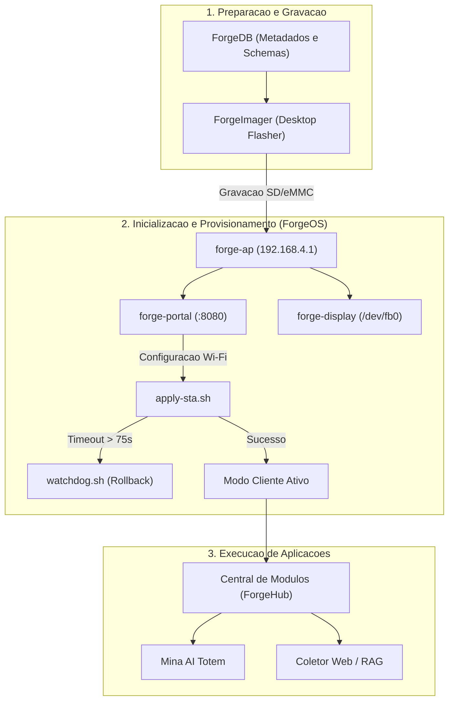

<p align="center">
  
</p>

# MultiForge

Plataforma open-source para identificacao, compatibilizacao, gravacao, provisionamento e modularizacao de hardware ARM reaproveitado (TV Boxes e SBCs comerciais legadas).

---

## Estado Funcional do Projeto

| Componente | Stack | Entradas Principais | Status | Testes / Cobertura |
|------------|-------|---------------------|--------|-------------------|
| **[ForgeImager](ForgeImager/)** | Tauri v2, React 19, Rust | `src-tauri/src/main.rs`, `App.tsx`, `crates/forge-write-conf` | Producao (98%) | CI Matrix (x64/ARM64 Linux, Windows, macOS) |
| **[ForgeOS](ForgeOS/)** | Linux 6.18, Python 3, Bash, systemd | `bin/start-ap.sh`, `web/server.py`, `display/display_manager.py`, `bin/watchdog.sh` | Homologado (95%) | 34/34 testes de integracao e E2E |
| **[ForgeDB](ForgeDB/)** | YAML, JSON Schema (Draft 2020-12) | `devices/btv/e10/device.yaml`, `modules/catalog.yaml`, `schemas/*.schema.json` | Estruturado (50%) | Validacao formal JSON Schema |
| **[ForgeModules](ForgeModules/)** | Python (PyQt5, FastAPI, LangChain) | `totem/main_cli.py`, `totem/main_gui.py`, `sub-modulos/web-scraping/api/main.py` | Funcional (45%) | Execucao local e em container |

> **Hardware Piloto Validado:** BTV Express E10 (Amlogic S905X2 / Meson G12A, 4x Cortex-A53 @ 1.8GHz, 2GB LPDDR4, 8GB eMMC, Realtek RTL8189FTV Wi-Fi SDIO, Armbian Linux 26.08 Trixie, kernel 6.18.44-ophub).

---

## Arquitetura do Sistema

O projeto e dividido em 4 componentes interdependentes:

```text
multi-forge/
|-- ForgeImager/        # Gravador desktop (Tauri v2 + React 19 + Rust)
|   |-- src-tauri/      # Comandos IPC em Rust, streaming I/O, EDL/QDL Sahara
|   |-- crates/         # forge-write-conf (injecao ext4 em userspace sem root)
|   `-- src/            # Interface gráfica, catalogo dinâmico, seletor de imagens
|-- ForgeOS/            # Distribuicao Linux e stack de provisionamento on-device
|   |-- bin/            # Scripts de controle de rede (start-ap.sh, apply-sta.sh, watchdog.sh)
|   |-- web/            # Portal HTTP offline, REST API e interface de configuracao
|   |-- display/        # Kiosk HDMI direto em framebuffer (/dev/fb0)
|   |-- dtb/            # Device Tree Sources (.dts) e Blobs compilados (.dtb)
|   |-- distro/         # Pipeline de build de imagens em nuvem (GCP Spot) e local
|   `-- tests/          # Suite de testes unitarios e de integracao
|-- ForgeDB/            # Base de dados declarativa de hardware e modulos
|   |-- devices/        # Metadados de placas (SoCs, DTBs, pinouts, metodos de flash)
|   |-- modules/        # Catalogo central (catalog.yaml) e manifestos (module.yaml)
|   `-- schemas/        # Schemas JSON formais para validacao automatizada
`-- ForgeModules/       # Modulos operacionais para aplicacoes de borda
    |-- totem/          # Mina - Assistente Virtual Acadêmica (PyQt5 + ONNX)
    `-- sub-modulos/    # Coletor Acadêmico & RAG Agent (FastAPI + LangChain)
```



---

## Guia de Uso por Componente

### 1. ForgeImager (Aplicativo Desktop)

```bash
cd ForgeImager

# Instalacao de dependencias e execucao em desenvolvimento:
pnpm install
pnpm tauri dev

# Compilacao de instaladores (.exe, .deb, .AppImage, .dmg):
pnpm tauri build
```

Recursos implementados:
- Descompressao multithread em tempo real (`.xz`, `.gz`, `.zst`, `.bz2`) com verificacao SHA-256 bloco a bloco.
- Injecao de configuracoes de primeiro boot diretamente em particoes ext4 via `forge-write-conf` sem necessidade de montagem de sistema de arquivos.
- Suporte a modo EDL/Sahara para recuperacao de placas Qualcomm.

### 2. ForgeOS (Sistema Embarcado)

```bash
cd ForgeOS

# Instalacao da stack em instalacoes Armbian existentes:
sudo bash install.sh

# Execucao dos testes unitarios:
python -m unittest discover -s tests -p "test_*.py" -v
```

Recursos implementados:
- Ponto de acesso Wi-Fi via `wpa_supplicant` mode=2 para contornar limitacoes do driver Realtek RTL8189FTV.
- Watchdog de rede com rollback automatico para modo AP em caso de credenciais incorretas ou perda de conexao.
- Kiosk grafico HDMI 1080p desenhado diretamente no `/dev/fb0` com exibicao de QR Codes para conexao rapida.
- Device Tree Enterprise com clock SDIO travado em 25 MHz, CMA reduzido para 64 MB (+192 MB de RAM disponivel) e watchdog de hardware ativo.

### 3. ForgeDB (Banco de Hardware e Modulos)

```bash
cd ForgeDB

# Validacao do device.yaml contra o schema formal:
python -c "import yaml, json, jsonschema; jsonschema.validate(yaml.safe_load(open('devices/btv/e10/device.yaml')), json.load(open('schemas/device.schema.json'))); print('Device schema validado.')"

# Validacao do manifesto de modulos:
python -c "import yaml, json, jsonschema; jsonschema.validate(yaml.safe_load(open('modules/totem/module.yaml')), json.load(open('schemas/module.schema.json'))); print('Module schema validado.')"
```

### 4. ForgeModules (Aplicacoes)

```bash
# Modulo Totem (Mina AI):
cd ForgeModules/totem
python install.py --headless
python main_cli.py

# Modulo Web Scraping & RAG:
cd ForgeModules/sub-modulos/web-scraping
docker compose up -d
```

---

## Documentacao Adicional

- [Arquitetura Geral](docs/architecture.md)
- [Documentacao Tecnica do ForgeOS](ForgeOS/README.md)
- [Manual de Tweaks e Patches](ForgeOS/docs/tweaks-and-patches.md)
- [Device Tree Sources e Compilacao](ForgeOS/dtb/README.md)
- [Pipeline de Build de Distro](ForgeOS/distro/README.md)
- [Manual do ForgeImager](ForgeImager/README.md)
- [Manual do ForgeDB](ForgeDB/README.md)
- [Especificacoes Tecnicas BTV E10](docs/btv-e10.md)
- [Roadmap do Projeto](docs/roadmap.md)

---

## Licenca

Projeto distribuido sob licenca MIT. Consulte o arquivo [LICENSE](LICENSE) para mais informacoes.
