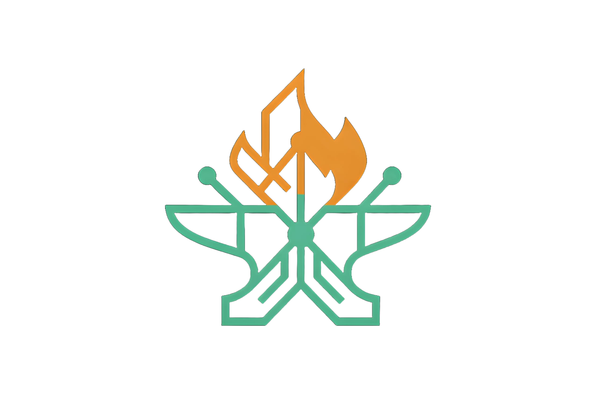

# 🛠️ MultiForge

<p align="center">
  
</p>

Plataforma open-source para identificação, compatibilização, provisionamento e modularização de hardware ARM reaproveitado (TV Boxes e SBCs legadas).

---

## 📊 Estado Funcional Real (Atualizado 28/08/2026)

| Componente | Stack Real | Entradas Principais (God Nodes) | Status | Testes |
|------------|------------|---------------------------------|--------|--------|
| **[ForgeImager](ForgeImager/)** | Tauri v2 + React 19 + Rust | `src-tauri/src/main.rs`, `App.tsx`, `crates/forge-write-conf` (`Ext4Inode`, `FlashState`) | **98%** (Produção) | CI Matrix (x64/ARM64) |
| **[ForgeOS](ForgeOS/)** | Python 3 + Bash + systemd | `bin/start-ap.sh`, `web/server.py` (v2.1), `display/qr_screen.py`, `bin/watchdog.sh` | **92%** (Piloto BTV E10) | 34/34 PASS (16 unit + 14 integ + 4 E2E) |
| **[ForgeDB](ForgeDB/)** | YAML / Markdown | `devices/btv/e10/device.yaml`, `images.yaml` | **35%** (1 device) | — |
| **[ForgeModules](ForgeModules/)** | Python (PyQt5, FastAPI, LangChain) | `totem/main_cli.py`, `totem/main_gui.py`, `sub-modulos/web-scraping/api/main.py` | **30%** (2 standalone) | pytest local |
| **ForgeHub** | — | `catalog.yaml` (ausente) | **10%** (Conceito) | — |

> **Hardware Piloto Validado:** BTV E10 (Amlogic S905X2, 2GB RAM, 8GB eMMC, Wi-Fi Realtek RTL8189FTV).

---

## ⚙️ Arquitetura e Fluxo de Execução

```text
multi-forge/
├── ForgeImager/        # Desktop Flasher (Tauri v2 + React 19 + Rust)
│   ├── src-tauri/      # 35+ IPC commands, EDL/QDL, block I/O (Win32/udisks2/authopen)
│   ├── crates/         # forge-write-conf (escrita userspace ext4 sem mount/root)
│   └── src/            # UI Wizard de 4 etapas, 18 idiomas, suporte dark/light
├── ForgeOS/            # Stack de provisionamento on-device (BTV E10)
│   ├── bin/            # start-ap.sh (wpa_supplicant m=2), apply-client.sh, watchdog.sh
│   ├── web/            # Portal HTTP offline (server.py v2.1 REST API + Enterprise SPA Dark/Light)
│   ├── display/        # Kiosk HDMI framebuffer 1080p pixel-perfect (qr_screen.py)
│   └── tests/          # Suíte de testes (run_all.sh, Playwright E2E)
├── ForgeDB/            # Metadados de hardware e imagens de boot por dispositivo
├── ForgeModules/       # Módulos operacionais (Mina/Totem voz acadêmica e Web-Scraping RAG)
└── graphify-out/       # Knowledge Graph (3.177 nós, 6.462 arestas, 200 comunidades)
```

---

## 🚀 Quick Start por Componente

### 1. ForgeImager (App Desktop)
```bash
cd ForgeImager
pnpm install
pnpm tauri dev       # Modo desenvolvimento com hot-reload
pnpm tauri build     # Gera binários assinados (.deb, .AppImage, .msi, .exe)
```
- **Gravação de Imagens:** Suporta streaming direto com verificação SHA256 em tempo real e descompressão multithread (`.xz`, `.gz`, `.zst`, `.bz2`).
- **Autoconfig Injection:** Injeta credenciais de primeiro boot no rootfs ext4 sem necessidade de privilégios de root do host.
- **Qualcomm EDL:** Suporte nativo a flashing de emergência via protocolo Sahara/Firehose (`VID 0x05C6`).

### 2. ForgeOS (On-Device Stack)
```bash
cd ForgeOS
sudo ./install.sh               # Instalação idempotente em Armbian
sudo ./tests/run_all.sh         # Executa os 30 testes unitários e de integração
```
- **Rede Resiliente:** AP cativo via `wpa_supplicant` mode=2 para contornar limitações de driver RTL8189FTV.
- **Rollback Automático:** Watchdog monitora conexão e reverte para AP caso ocorra falha de DHCP/DNS ou perda de internet (>5 min).
- **Kiosk HDMI:** Renderização direta em `/dev/fb0` com dual QR code (conexão Wi-Fi e portal).

### 3. ForgeModules
```bash
# Totem (Assistente Virtual Mina - CLI ou GUI PyQt5)
cd ForgeModules/totem && python install.py && python main_cli.py

# Web-Scraping & RAG Agent
cd ForgeModules/sub-modulos/web-scraping && docker compose up -d
```

---

## 🔍 Navegação Eficiente via Knowledge Graph (Graphify)

O repositório possui uma malha de código indexada via AST local pelo Graphify (`graphify-out/`).

```bash
# Visualização interativa no navegador
start graphify-out/graph.html              # Grafo de conceitos e comunidades
start graphify-out/multi-forge-callflow.html # Diagramas Mermaid de call-flow

# Consultas estruturadas (sem varredura manual de arquivos)
graphify query "como o watchdog realiza o rollback de rede?"
graphify path "FlashState" "watchdog.sh"
graphify explain "Ext4Inode"

# Atualização incremental após alterações
graphify extract . --code-only --update
```

---

## 🎯 Gaps Críticos para Fechar o Ciclo MVP (Phase 1)

1. **Alinhamento de Contrato de Autoconfig:** `ForgeImager` injeta `/root/.not_logged_in_yet` (formato Armbian), enquanto o provisioner do `ForgeOS` espera parâmetros via portal web ou `/boot/forge/forge.yaml`.
2. **Manifesto `module.yaml`:** Padronizar os contratos de instalação do Totem e Web-Scraping para que o `ForgeOS` possa acioná-los automaticamente.
3. **JSON Schemas no ForgeDB:** Implementar validação formal em `ForgeDB/schemas/` para validar novos dispositivos via CI.

---

## 📖 Documentação Completa

* [Arquitetura Geral](docs/architecture.md)
* [Roadmap de 3 Fases](docs/roadmap.md)
* [Guia Técnico BTV E10 (Flashing, UART, Pinouts)](docs/btv-e10.md)
* [Auditoria Interna de Engenharia](docs/audit-2026-08-24.md)
* [Guia de Desenvolvimento do ForgeImager](ForgeImager/DEVELOPMENT.md)

---

## 📝 Changelog Recente

### 28/08/2026 — Sprint de Consolidação (5 commits)

**ForgeOS** (85% → **92%**):
- `server.py` v2.1: REST API completa (`/rest/features`, `/rest/systemStatus`, `/rest/wifiStatus`, `/rest/wifiScan`, etc.) compatível com ESP32-SvelteKit
- Novo Web UI enterprise-grade: Dark Mode (padrão) + Light Mode, sidebar navigation, KPI cards em tempo real (RAM, CPU, Uptime), Wi-Fi scanner com barras de sinal dBm, modal de conexão dual-mode (WPA-PSK + WPA2-Enterprise 802.1X)
- Suporte cross-platform: fallback `netsh wlan` para Windows, `tempfile.gettempdir()`, correção de encoding `cp1252`
- Logo e favicon customizados integrados ao brand header da sidebar
- 16/16 testes unitários passando em Windows e Linux

**ForgeImager** (98% — mantido):
- Refactor completo de branding: Armbian → MultiForge (ícones, assets, temas, modais)
- Integração dinâmica com GitHub Releases (`forge-images.json`) para download de imagens
- Tema 3D overhaul com nova paleta de cores enterprise
- Scripts de build e dev (`build.bat`, `start-dev.bat`, `start-app.bat`)
- `release_assets/forge-images.json` como manifesto centralizado de imagens

---

## 📜 Licença

Distribuído sob licença **MIT**. Consulte [LICENSE](LICENSE) para mais detalhes.
