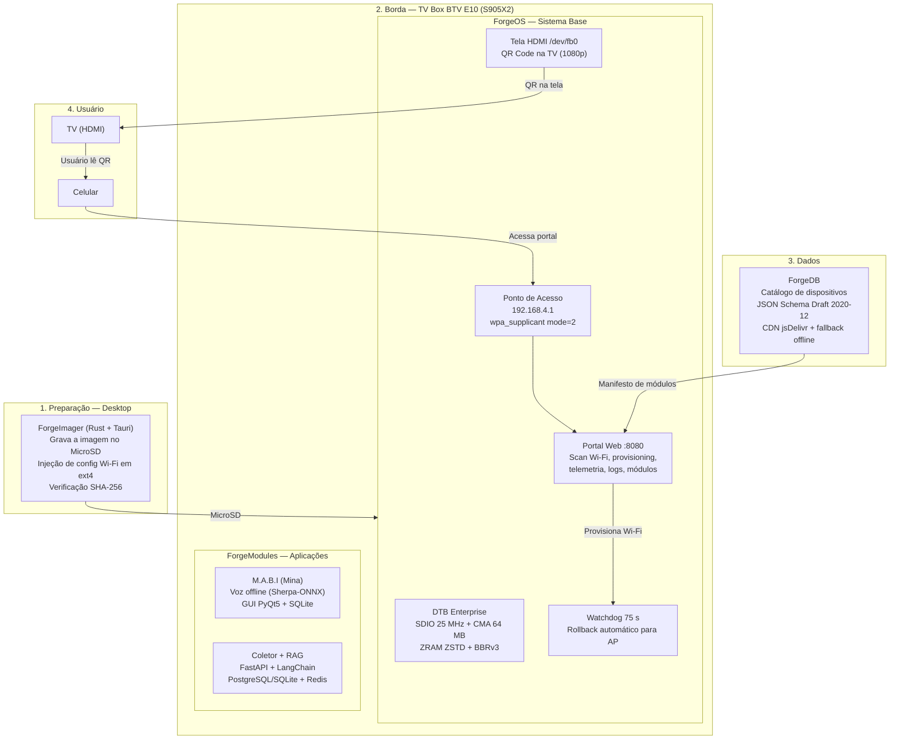
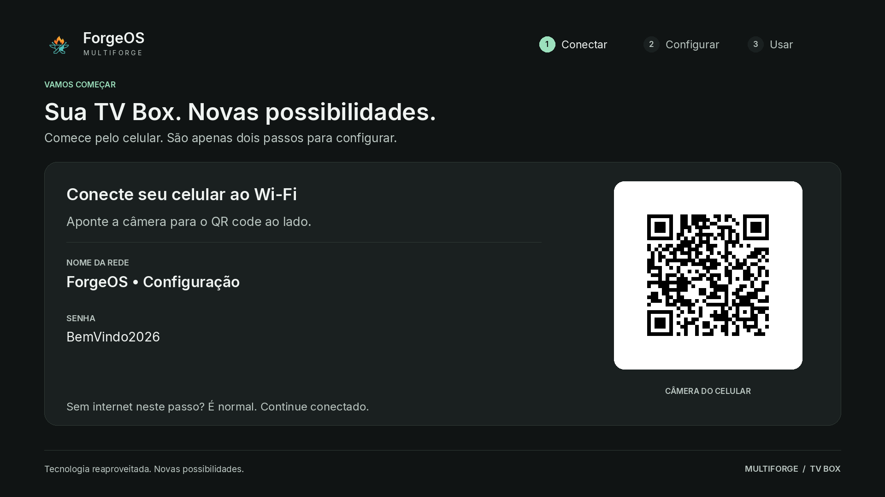
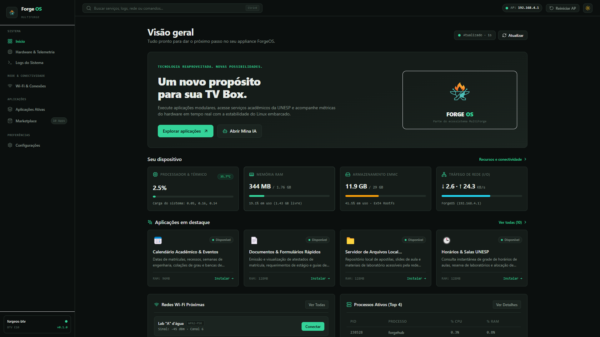
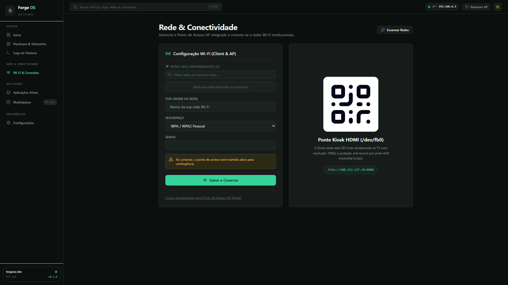
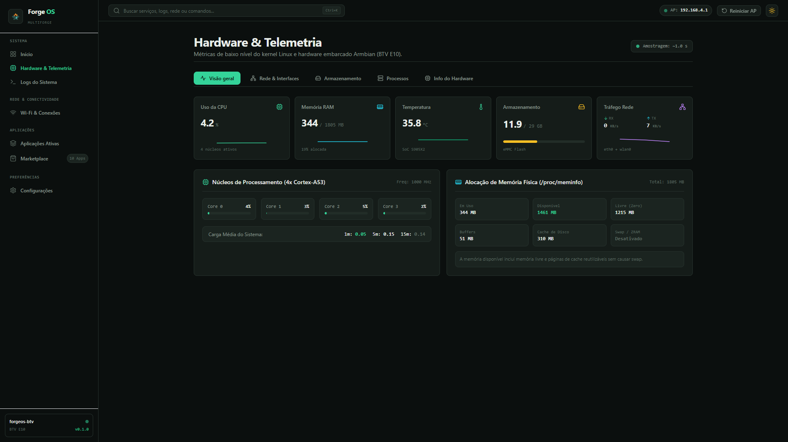
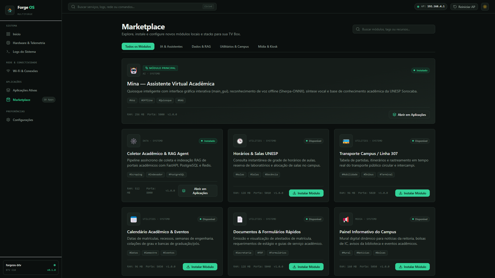
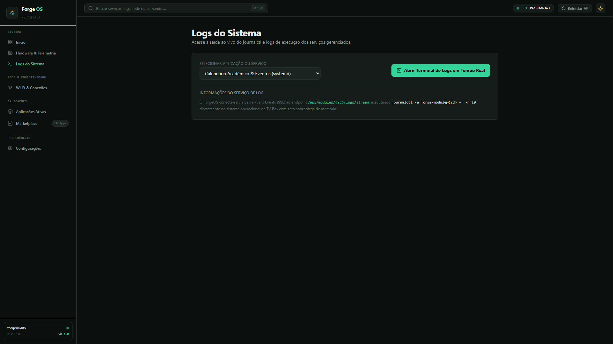
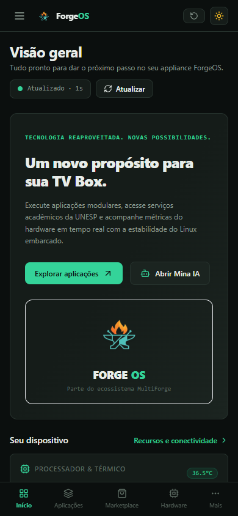

<p align="center">
  
</p>

<p align="center">
  
  
  
  
</p>

# MultiForge — Plataforma de Provisionamento e Reaproveitamento de TV Boxes Apreendidas

> 1º Hackathon TV Box Unesp Sorocaba — Equipe 1

---

## Resumo

O **MultiForge** é uma plataforma open-source de preparação, provisionamento e gerenciamento de dispositivos ARM, voltada ao reaproveitamento de TV Boxes apreendidas como computadores de borda para uso educacional. A proposta é oferecer uma base reutilizável para diferentes aplicações, desde o catálogo de hardware e a gravação do sistema até a configuração de rede e a operação dos módulos.

Na BTV E10 (2 GB de RAM e 8 GB de eMMC), a plataforma reúne Linux otimizado, configuração Wi-Fi pelo celular via QR Code na TV, monitoramento do equipamento e recuperação automática de falhas de conexão. Assim, a infraestrutura de implantação fica separada das aplicações que o dispositivo executa.

**Módulo principal: M.A.B.I (Mina — Assistente Baseada em Inteligência).** A assistente acadêmica transforma a TV Box em um totem interativo de acesso a informações universitárias, com reconhecimento de voz offline, interface gráfica na TV e consulta a dados acadêmicos locais. O coletor acadêmico RAG complementa essa aplicação com recursos de busca e indexação; funcionalidades conectadas dependem dos serviços disponíveis.

### Componentes da plataforma

| Componente | O que faz |
|---|---|
| **ForgeImager** | Gravador desktop (Rust + Tauri v2 + React 19): grava a imagem no MicroSD, verifica SHA-256 e injeta configurações de primeiro boot em ext4 sem montagem no host |
| **ForgeOS** | Sistema base da TV Box: reúne ponto de acesso Wi-Fi, portal web, tela HDMI de configuração e watchdog com rollback automático |
| **ForgeDB** | Catálogo de dispositivos, imagens e módulos, com validação por JSON Schema e distribuição via CDN com fallback offline |
| **ForgeModules** | Camada de aplicações modulares, com manifesto `module.yaml`; a **Mina é o módulo principal** da proposta educacional |

O MultiForge fornece a infraestrutura comum; a Mina demonstra seu uso principal na educação. Essa separação permite ampliar a plataforma com outros módulos sem refazer o processo de preparação e configuração do equipamento.

**Repo principal (código completo):** https://github.com/multi-forge/multi-forge

---

## Membros da Equipe 1

* [Brenda Biral](https://github.com/BrendaBiral) ([@BrendaBiral](https://github.com/BrendaBiral))
* [Adriel Henrique Souza](https://github.com/AdrielH024) ([@AdrielH024](https://github.com/AdrielH024))
* [Marcos Oliveira e Silva](https://github.com/marquinho20-bot) ([@marquinho20-bot](https://github.com/marquinho20-bot))
* [Isaac Andrade](https://github.com/alguemaiYT) ([@alguemaiYT](https://github.com/alguemaiYT))

---

## Objetivo do projeto

Validar que uma TV Box apreendida e reaproveitada pode funcionar como um **totem acadêmico autônomo**, capaz de:

- Operar como ponto de acesso Wi-Fi para configuração inicial sem teclado, mouse ou monitor externo — apenas TV + celular;
- Provisionar conexão com redes universitárias (incluindo eduroam com EAP/802.1X);
- Recuperar-se automaticamente de falhas de conexão sem intervenção humana;
- Hospedar uma assistente virtual acadêmica com reconhecimento de voz offline;
- Servir como plataforma extensível para outros módulos de aplicação;
- Funcionar dentro das restrições de 2 GB de RAM e armazenamento limitado.

---

## Motivação

Projetos de inclusão digital e informação acadêmica normalmente dependem de computadores convencionais, terminais dedicados ou aplicativos mobile — todos com custo ou dependência de infraestrutura que limita a implantação.

A Multi-Forge propõe reaproveitar TV Boxes apreendidas pela Anatel como computadores de borda de baixo custo. A M.A.B.I é a prova de que esse hardware, com as otimizações certas, pode entregar uma experiência útil e acessível.

---

## Arquitetura

O sistema opera em quatro camadas independentes:



### Princípios de projeto

- **Offline-first:** todo o provisionamento funciona sem internet — a box cria sua própria rede.
- **Sem periféricos:** não precisa de teclado, mouse nem monitor. A TV mostra o QR, o celular faz o resto.
- **Recuperação automática:** se a senha do Wi-Fi estiver errada ou a rede cair, o watchdog restaura o ponto de acesso em 75 segundos.
- **Modular:** a Mina (M.A.B.I) é o módulo principal da proposta educacional; outras aplicações podem ampliar a plataforma por meio de manifestos `module.yaml`.

---

## Fluxos principais

### Onboarding — Da caixa lacrada ao totem funcionando

```
  TV Box lacrada
       ↓
  Grava MicroSD com ForgeImager (PC)
       ↓
  Insere o cartão, liga HDMI + energia
       ↓
  TV mostra QR Code do ponto de acesso
       ↓
  Celular lê o QR → conecta no Wi-Fi "ForgeOS-Setup-E10"
       ↓
  Abre http://192.168.4.1:8080 → portal web
       ↓
  Escolhe a rede Wi-Fi da universidade
       ↓
  Box conecta → TV mostra telemetria (IP, temp, RAM)
       ↓
  M.A.B.I inicia e fica pronta para uso
```

### Provisionamento Wi-Fi (portal web no celular)

1. O portal faz scan das redes próximas e mostra na tela do celular, com intensidade de sinal (RSSI) e tipo de segurança.
2. O usuário escolhe a rede. Para redes WPA2-PSK, basta digitar a senha. Para redes EAP (eduroam), o portal pede método (PEAP/TTLS/PWD/TLS), identidade e credenciais.
3. A box aplica as credenciais via `wpa_supplicant`, testa a conexão (verifica IP + gateway) e informa o resultado na TV.
4. Se falhar, o watchdog restaura o ponto de acesso automaticamente em 75 segundos — sem precisar reiniciar.

### Rollback automático (watchdog)

```
  Box conecta na rede solicitada
       ↓
  Watchdog monitora a cada 75 s:
    - Verifica se há IP válido
    - Testa alcance do gateway
       ↓
  Se falhar:
    - Restaura modo AP (192.168.4.1)
    - TV volta a mostrar QR
    - Portal reabre para nova tentativa
```

### Interação com a M.A.B.I

1. O usuário fala uma pergunta ao microfone conectado à TV Box.
2. O Sherpa-ONNX faz o reconhecimento de voz **localmente**, sem enviar áudio para a nuvem.
3. A M.A.B.I consulta os dados acadêmicos locais (SQLite) e, se disponível, complementa com recursos de IA conectados (LangChain + RAG).
4. A resposta aparece na tela da TV (PyQt5) e é reproduzida por síntese de voz.

---

## Stack técnica

| Camada | Tecnologia | Função |
|---|---|---|
| **Gravação** | Rust + Tauri v2 + React 19 | ForgeImager: grava imagem, injeta configuração em ext4 sem root no host |
| **Kernel e boot** | Linux 6.18 ARM64, Armbian Trixie | DTB customizado com SDIO 25 MHz, CMA 64 MB, watchdog do SoC |
| **Memória** | MGLRU + ZRAM ZSTD (50% da RAM) | Compressão 3:1, elimina desgaste da eMMC |
| **Rede** | wpa_supplicant mode=2, BBRv3, fq | AP automático + suporte EAP completo |
| **Portal web** | Python 3 (stdlib), HTML/CSS/JS | 13 KB, zero dependência externa, SPA responsiva |
| **Display HDMI** | Pillow + framebuffer /dev/fb0 | QR Code 1080p direto na TV, sem servidor gráfico (X11/Wayland) |
| **M.A.B.I (voz)** | Sherpa-ONNX, PyQt5, SQLite | Reconhecimento de voz offline + GUI em tela de TV |
| **Coletor RAG** | FastAPI, LangChain, PostgreSQL/SQLite, Redis | Busca e indexação de dados acadêmicos |
| **Catálogo** | JSON Schema Draft 2020-12, jsDelivr | ForgeDB: validação em CI, CDN + fallback offline |
| **Testes** | unittest, Playwright | 34 testes (unitários + integração + E2E) |

---

## Telas reais (sem mock)

### Tela HDMI (framebuffer /dev/fb0)

A TV Box renderiza diretamente no framebuffer Linux — não precisa de servidor gráfico.

| QR Code do ponto de acesso |
| :---: |
|  |

### Portal web (`:8080`) — acessado pelo celular

| Visão geral | Rede | Serviços |
| :---: | :---: | :---: |
|  |  |  |

| Módulos | Logs RFC 5424 | Mobile |
| :---: | :---: | :---: |
|  |  |  |

---

## Hardware utilizado

| Componente | Especificação |
|---|---|
| Dispositivo | BTV Express E10 (TV Box apreendida) |
| Processador | Amlogic S905X2 (Meson G12A), 4× Cortex-A53 @ 1.80 GHz |
| GPU | ARM Mali-G31 MP2 |
| RAM | 2 GB LPDDR4 (1.85 GB visíveis) |
| Armazenamento | 8 GB eMMC 5.1 + leitor MicroSD |
| Wi-Fi | Realtek RTL8189FTV (SDIO, 2.4 GHz 802.11 b/g/n) |
| Ethernet | Realtek RTL8211F (10/100 Mbps) |
| Vídeo | HDMI 2.0a (1080p @ 60 Hz) |
| Sistema | Armbian 26.08 Trixie (Debian 13 Minimal), kernel 6.18 ARM64 |

---

## Otimizações aplicadas

A distribuição inclui patches em nível de kernel, device tree, rede e gerenciamento de memória para garantir estabilidade no hardware da TV Box:

| Otimização | O que faz | Por que importa |
|---|---|---|
| DTB Enterprise (SDIO 25 MHz) | Trava a frequência do barramento Wi-Fi e desativa modo highspeed | Elimina erros de CRC e quedas de firmware do RTL8189FTV |
| CMA 64 MB (vs. 256 MB padrão) | Reduz o buffer de vídeo contíguo | Libera 192 MB de RAM para aplicações |
| ZRAM ZSTD (50% RAM) | Swap comprimido em RAM com taxa 3:1 | Elimina desgaste de escrita na eMMC |
| MGLRU | Escalonador de memória multi-geração | Melhor aproveitamento de cache em 2 GB |
| BBRv3 + fq | Controle de congestionamento do Google | Throughput mais estável em Wi-Fi instável |
| Watchdog do SoC | `/dev/watchdog` nativo Amlogic | Reinício automático se o sistema travar |

---

## Serviços systemd

| Unidade | Tipo | Função |
|---|---|---|
| `forge-ap.service` | oneshot | Configura wlan0, gateway 192.168.4.1 e inicia dnsmasq |
| `forge-portal.service` | simple | Servidor HTTP na porta 8080 (scan, provisioning, telemetria) |
| `forge-display.service` | simple | Renderiza tela HDMI no /dev/fb0 (QR + estados) |
| `forge-watchdog.service` | simple | Monitora conectividade com rollback em 75 s |
| `forge-fbcon-disable.service` | oneshot | Desativa cursor e blanking de tela no HDMI |

---

## API REST do portal

| Endpoint | Método | Descrição |
|---|---|---|
| `/api/status` | GET | Estado operacional (modo AP ou cliente, SSID, IP) |
| `/api/scan` | GET | Varredura de redes Wi-Fi próximas com RSSI e tipo de segurança |
| `/api/provision` | POST | Aplica credenciais Wi-Fi e aciona teste de conectividade |
| `/api/reset` | POST | Reverte para modo ponto de acesso |
| `/api/telemetry` | GET | Temperatura CPU, frequência, RAM, ZRAM, disco |
| `/rest/modules` | GET | Lista de módulos cadastrados no ForgeDB e estado local |

---

## Estrutura do projeto

```
Projeto Equipe 1/
├── readme.md                    # Este arquivo
├── ForgeOS/                     # Sistema base da TV Box
│   ├── bin/
│   │   ├── start-ap.sh            # Inicialização do ponto de acesso
│   │   ├── apply-sta.sh           # Aplicação de credenciais Wi-Fi
│   │   └── watchdog.sh            # Monitoramento + rollback (75 s)
│   ├── web/
│   │   ├── server.py              # Servidor HTTP REST (stdlib Python)
│   │   └── index.html             # Portal SPA responsivo
│   ├── display/
│   │   └── display_manager.py     # Renderização HDMI via /dev/fb0
│   ├── dtb/
│   │   ├── meson-g12a-btv-e10-enterprise.dts  # Device Tree (fonte)
│   │   └── meson-g12a-btv-e10-enterprise.dtb  # DTB compilado
│   ├── distro/
│   │   ├── build-image.sh         # Pipeline de construção de imagem
│   │   └── gcp-spot-launcher.py   # Compilação em instância Spot GCP
│   ├── systemd/                   # Units dos serviços
│   └── tests/                     # Testes do servidor e DTB
│
├── ForgeModules/                # Aplicações modulares
│   ├── totem/                     # M.A.B.I (Mina)
│   │   ├── main_gui.py             # Interface PyQt5 para TV
│   │   ├── main_cli.py             # Modo terminal
│   │   ├── src/                     # Core da assistente
│   │   ├── models/                  # Modelos Sherpa-ONNX
│   │   ├── keywords/                # Wake words
│   │   └── module.yaml              # Manifesto para ForgeOS
│   └── sub-modulos/
│       └── web-scraping/            # Coletor RAG acadêmico
│           ├── collector/             # Scraping assíncrono (aiohttp)
│           ├── api/                   # FastAPI + rotas REST
│           ├── agent/                 # LangChain + RAG
│           ├── database/              # PostgreSQL + SQLAlchemy
│           └── frontend/              # Dashboard web
│
├── ForgeDB/                     # Catálogo de dispositivos e módulos
│   ├── devices/                   # Especificações de hardware
│   ├── modules/                   # Catálogo de módulos (catalog.yaml)
│   └── schemas/                   # JSON Schema para validação
│
├── ForgeImager/                 # Gravador desktop (Rust + Tauri + React)
│   ├── src-tauri/                 # Backend Rust
│   ├── crates/
│   │   └── forge-write-conf/        # Injeção em ext4 sem mount
│   └── src/                       # Frontend React
│
├── docs/                        # Auditorias e documentação técnica
└── imagens/                     # Screenshots reais + logo
```

---

## Como reproduzir

### 1. Imagem e ForgeImager

- [Imagem pré-compilada do sistema](https://github.com/gasiepgodoy/Hackathon-TV-Box-E10/releases/tag/equipe1-v1.2.0)
- [ForgeImager — código-fonte e instruções de compilação](https://github.com/multi-forge/multi-forge/tree/main/ForgeImager)

### 2. Gravação no MicroSD

```bash
# Opção A: ForgeImager (interface gráfica)
cd ForgeImager && pnpm install && pnpm tauri dev

# Opção B: Linha de comando
xzcat forgeos-btv-e10.img.xz | sudo dd of=/dev/sdX bs=4M status=progress && sync
```

### 3. Primeiro boot

1. Insira o MicroSD na BTV E10.
2. Conecte o cabo HDMI na TV e ligue a energia.
3. Aguarde ~30 segundos — a TV mostra o QR Code do ponto de acesso.
4. No celular, leia o QR Code (ou conecte manualmente na rede `ForgeOS-Setup-E10`).
5. Abra `http://192.168.4.1:8080` no navegador do celular.
6. Escolha a rede Wi-Fi, insira as credenciais e aguarde a confirmação na TV.

### 4. Acesso posterior

- **Portal web:** `http://<ip-da-box>:8080`
- **SSH:** `ssh root@<ip-da-box>`

---

## Demo — Roteiro da final (18/09, 3 minutos)

| Tempo | Ação | O que aparece |
|---|---|---|
| 0:00 | Box liga, TV mostra QR | Tela HDMI com QR do AP |
| 0:30 | Celular conecta no AP, abre portal | Portal web no celular com scan de redes |
| 1:00 | Provisiona a rede Wi-Fi | TV muda para tela de conexão → sucesso |
| 1:30 | Mostra portal `:8080` com telemetria | Dashboard: CPU, RAM, temperatura, IP, módulos |
| 2:00 | Mostra M.A.B.I respondendo uma pergunta | Assistente com voz na TV |
| 2:30 | Erra a senha de propósito | Tela FAILED → watchdog restaura AP em 75 s |

---

## Diferenciais

| Diferencial | Descrição |
|---|---|
| **Zero periféricos** | Não precisa de teclado, mouse nem monitor externo — TV + celular bastam |
| **Offline-first completo** | Provisionamento, portal, watchdog e M.A.B.I (voz) funcionam sem internet |
| **EAP/802.1X nativo** | Suporte a PEAP, TTLS, PWD e TLS — conecta direto na eduroam |
| **Rollback automático** | Watchdog de 75 s restaura AP sem intervenção, sem reiniciar |
| **Gravação sem root** | ForgeImager injeta configuração em ext4 sem precisar de `mount` no host |
| **Voz offline** | Sherpa-ONNX roda reconhecimento de fala no próprio ARM64, sem enviar áudio para a nuvem |
| **Modular** | Qualquer aplicação pode ser adicionada como módulo via `module.yaml` + catálogo ForgeDB |
| **DTB customizado** | Patches de hardware validados no dispositivo real (SDIO, CMA, watchdog) |
| **Portal leve** | 13 KB, zero dependência externa, funciona em qualquer navegador mobile |

---

## Evidências técnicas

- **DTB `meson-g12a-btv-e10-enterprise.dts`:** SDIO 25 MHz (RTL8189FTV), CMA 64 MB, watchdog habilitado.
- **Portal 13 KB**, zero dependência externa, EAP completo (PEAP/TTLS/PWD/TLS).
- **ForgeDB** validado em CI (JSON Schema Draft 2020-12) + CDN jsDelivr + fallback offline.
- **34 testes** do Provisioner (unitários + integração + E2E Playwright).
- **ForgeImager** com injeção userspace em ext4 (`forge-write-conf`) sem necessidade de mount.
- **Compilação de imagem** automatizada em instância Spot do Google Cloud Platform.

---

## Estado atual

| Componente | Estado |
|---|---|
| ForgeOS (AP, portal, watchdog, display) | ✅ Funcional e testado no hardware |
| ForgeImager (gravação + injeção ext4) | ✅ Funcional (Windows, Linux, macOS) |
| ForgeDB (catálogo + schemas) | ✅ Validado em CI |
| M.A.B.I — voz offline + GUI | ✅ Estável |
| Coletor RAG (web-scraping) | ✅ Homologado |
| Suporte eduroam (EAP) | ✅ Testado |
| Testes automatizados | ✅ 34 testes passando |

---

## Artigo

- [📄 Artigo em PDF (neste repositório)](docs/artigo-multiforge.pdf)
- [Leia/editável no Overleaf](https://www.overleaf.com/read/gbwypjdbnhwg#d3352f)

---

## Licença

MIT — 1º Hackathon TV Box Unesp Sorocaba (2026).
