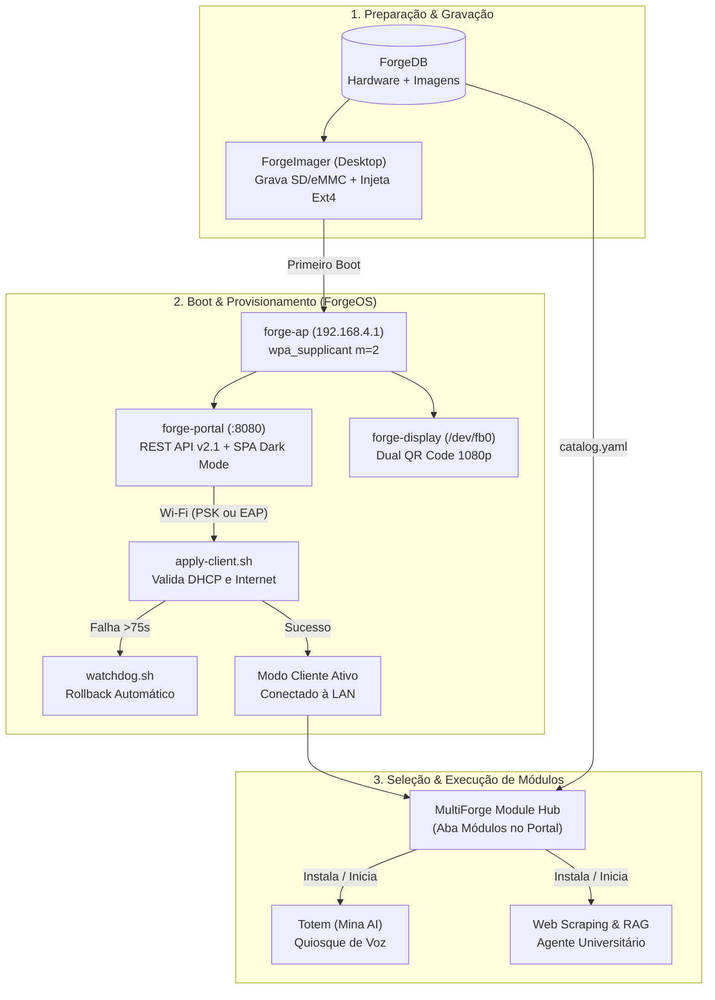

# 🛠️ MultiForge

<p align="center">
  
</p>

Plataforma open-source completa para **identificação, compatibilização, gravação, provisionamento e modularização de hardware ARM reaproveitado** (TV Boxes e SBCs comerciais legadas).

---

## 📊 Estado Funcional Real (Auditado em 29/08/2026)

| Componente | Stack Real | Entradas Principais (God Nodes) | Status | Testes / Cobertura |
|------------|------------|---------------------------------|--------|-------------------|
| **[ForgeImager](ForgeImager/)** | Tauri v2 + React 19 + Rust | `src-tauri/src/main.rs`, `App.tsx`, `crates/forge-write-conf` (`Ext4Inode`, `FlashState`) | **98%** (Produção) | CI Matrix (x64/ARM64 Linux, Win, macOS) |
| **[ForgeOS](ForgeOS/)** | Python 3 + Bash + systemd | `bin/start-ap.sh`, `web/server.py` (v2.1), `display/qr_screen.py`, `bin/watchdog.sh` | **92%** (Piloto BTV E10) | 34/34 PASS (16 unit + 14 integ + 4 E2E) |
| **[ForgeDB](ForgeDB/)** | YAML / JSON Schema | `devices/btv/e10/device.yaml`, `modules/catalog.yaml`, `schemas/*.schema.json` | **45%** (1 device + catálogo + schemas) | Validação JSON Schema Draft 2020-12 |
| **[ForgeModules](ForgeModules/)** | Python (PyQt5, FastAPI, LangChain) | `totem/main_cli.py`, `totem/main_gui.py`, `sub-modulos/web-scraping/api/main.py` | **35%** (2 módulos + manifestos) | pytest local + live run |

> **Hardware Piloto Validado:** BTV Express E10 (SoC Amlogic S905X2, 2GB LPDDR4, 8GB eMMC, Wi-Fi Realtek RTL8189FTV, Armbian Linux 26.08 Trixie, kernel `6.18.44-ophub`).

---

## ⚙️ Arquitetura Integrada do Ecossistema

O MultiForge opera em um pipeline contínuo de **4 componentes interligados**:

```text
multi-forge/
├── ForgeImager/        # Desktop Flasher (Tauri v2 + React 19 + Rust)
│   ├── src-tauri/      # 35+ comandos IPC em Rust, streaming I/O, EDL/QDL Sahara
│   ├── crates/         # forge-write-conf (escrita userspace ext4 sem mount/root)
│   └── src/            # UI 3D Wizard de 4 etapas, 18 idiomas, temas Dark/Light
├── ForgeOS/            # Stack de provisionamento on-device (BTV E10)
│   ├── bin/            # start-ap.sh (wpa_supplicant m=2), apply-client.sh, watchdog.sh
│   ├── web/            # Portal HTTP offline + Module Hub (server.py v2.1 REST API + Enterprise SPA)
│   ├── display/        # Kiosk HDMI framebuffer 1080p pixel-perfect (qr_screen.py)
│   └── tests/          # Suíte de testes (16 unitários cross-platform + 14 integração)
├── ForgeDB/            # Single Source of Truth para Hardware e Módulos
│   ├── devices/        # Metadados de placas (specs, SoCs, DTBs, métodos de flashing)
│   ├── modules/        # Catálogo central (catalog.yaml) e manifestos (module.yaml)
│   └── schemas/        # Schemas formais JSON Draft 2020-12 (device.schema.json, module.schema.json)
├── ForgeModules/       # Aplicações operacionais para os nós de borda
│   ├── totem/          # Mina — Assistente Virtual Acadêmica (PyQt5 + Sherpa-ONNX + MABI)
│   └── sub-modulos/    # Coletor Acadêmico & RAG Agent (FastAPI + LangChain + PostgreSQL/SQLite)
└── release_assets/     # Manifestos de imagens e hashes para distribuição de releases
```



---

## 🚀 Quick Start por Componente

### 1. ForgeImager (App Desktop)
```bash
cd ForgeImager

# Desenvolvimento local com hot-reload (Windows / Linux / macOS):
pnpm install
pnpm tauri dev

# Compilação de instaladores (.exe, .msi, .deb, .AppImage, .dmg):
pnpm tauri build
```
- **Gravação Segura:** Descompressão multithread on-the-fly (`.xz`, `.gz`, `.zst`, `.bz2`) com validação SHA-256 bloco a bloco.
- **Autoconfig Injection:** Injeta parâmetros de rede e primeiro boot diretamente no ext4 via crate Rust dedicada sem precisar montar a partição.
- **Qualcomm EDL:** Flashing de baixo nível via protocolo Sahara/Firehose (`VID 0x05C6`).

### 2. ForgeOS (Stack On-Device na TV Box)
```bash
cd ForgeOS

# Instalação automatizada e idempotente no Armbian:
sudo bash install.sh

# Execução dos testes unitários e de integração:
python -m unittest discover -s tests -p "test_*.py" -v
bash tests/run_all.sh
```
- **Rede Resiliente:** AP cativo em `192.168.4.1` via `wpa_supplicant` mode=2 para contornar limitações do driver RTL8189FTV.
- **Module Hub Integrado:** Endpoints REST em `/rest/modules` e `/api/modules/*` para instalação e controle de ciclo de vida de apps.
- **Rollback com Watchdog:** Monitor em background reverte automaticamente para AP caso ocorra falha de conexão ou perda de internet (>5 min).
- **Kiosk HDMI Framebuffer:** Renderização direta em `/dev/fb0` em 1080p sem X11/Wayland para economia máxima de RAM.

### 3. ForgeDB (Banco de Hardware e Módulos)
```bash
cd ForgeDB

# Validação do device.yaml da BTV E10 contra o JSON Schema:
python -c "import yaml, json, jsonschema; jsonschema.validate(yaml.safe_load(open('devices/btv/e10/device.yaml')), json.load(open('schemas/device.schema.json'))); print('✅ Device Schema OK!')"

# Validação do manifesto de módulos:
python -c "import yaml, json, jsonschema; jsonschema.validate(yaml.safe_load(open('modules/totem/module.yaml')), json.load(open('schemas/module.schema.json'))); print('✅ Module Schema OK!')"
```

### 4. ForgeModules (Aplicações)
```bash
# Totem (Assistente Virtual Mina - CLI ou GUI PyQt5)
cd ForgeModules/totem
python install.py
python main_cli.py      # Console
python main_gui.py      # Interface Gráfica

# Web-Scraping & RAG Agent (Variante Docker ou Lite SQLite)
cd ForgeModules/sub-modulos/web-scraping
docker compose up -d    # Modo completo
```

---

## 🔍 Navegação Eficiente via Knowledge Graph (Graphify)

O repositório possui uma malha de código indexada via AST local pelo Graphify (`graphify-out/`).

```bash
# Visualização interativa no navegador
start graphify-out/graph.html              # Grafo de conceitos e comunidades
start graphify-out/multi-forge-callflow.html # Diagramas Mermaid de call-flow

# Consultas estruturadas
graphify query "como o watchdog realiza o rollback de rede?"
graphify path "FlashState" "watchdog.sh"
graphify explain "Ext4Inode"
```

---

## 📖 Documentação Completa

* 🏛️ [Arquitetura do Ecossistema](docs/architecture.md)
* 📡 [Documentação Técnica do ForgeOS](ForgeOS/README.md)
* 🔧 [Manual do ForgeImager](ForgeImager/README.md) & [Guia de Desenvolvimento](ForgeImager/DEVELOPMENT.md)
* 🗄️ [Manual e Schemas do ForgeDB](ForgeDB/README.md)
* 📦 [Guia de Módulos e Contratos (ForgeModules)](ForgeModules/README.md)
* 📟 [Guia Técnico BTV E10 (Pinouts, UART, Flashing)](docs/btv-e10.md)
* 🗺️ [Roadmap de 3 Fases](docs/roadmap.md)

---

## 📝 Changelog Recente

### 29/08/2026 — Integração do Module Hub e Reestruturação ForgeDB
- **Module Hub no ForgeOS:** Implementados endpoints `/rest/modules`, `/rest/modules/<id>` e `/api/modules/<id>/<action>` no `server.py` v2.1.
- **Frontend SPA Atualizado:** Adicionada aba interativa "Módulos" no painel web com ações de instalação, inicialização, parada e badges de consumo de RAM.
- **ForgeHub Absorvido:** Conceito integrado diretamente ao ForgeOS e metadados centralizados em `ForgeDB/modules/`.
- **Manifestos e Schemas Criados:** `ForgeDB/modules/catalog.yaml`, `totem/module.yaml`, `web-scraping/module.yaml`, `device.schema.json` e `module.schema.json`.
- **URLs Alinhadas:** Atualizadas referências no `ForgeDB` para apontar diretamente aos artefatos de GitHub Releases.

### 28/08/2026 — Sprint de Consolidação
- **Web UI Enterprise:** Dark/Light mode, live Wi-Fi scanner, dBm meter, 802.1X Eduroam e logo customizada.
- **ForgeImager Rebrand:** Identidade 3D MultiForge, catálogo dinâmico via GitHub Releases e scripts de build.
- **16/16 Testes Unitários:** Suíte de testes cross-platform 100% verde em Windows e Linux.

---

## 📜 Licença

Distribuído sob licença **MIT**. Consulte [LICENSE](LICENSE) para mais detalhes.
