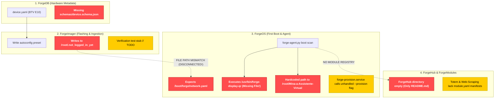

# 🛠️ MultiForge Repository Audit & Critical Path Action Plan

## Goal Description
Perform a comprehensive technical audit of the **MultiForge** repository (`https://github.com/multi-forge/multi-forge`). The audit scanned all 5 core components (**ForgeDB**, **ForgeImager**, **ForgeOS**, **ForgeHub**, **ForgeModules**) for missing implementation details, `TODO`/`FIXME` tags, mock data, and disconnected workflows along the **critical user path** (Hardware Specs → Flashing & Ingestion → Boot & Provisioning → Module Execution).

This document outlines:
1. **O que mudou e por quê?**: Context behind the scan parameters and why these specific issues were prioritized.
2. **End-to-End Pipeline Vulnerability Diagram**: Visual map showing where the critical path breaks.
3. **Prioritized Action Plan for Tomorrow**: Grouped into **Blockers (P0)**, **High-Leverage (P1)**, and **Quick Wins (P2)**.
4. **Detailed Technical Fixes**: File-by-file changes required to unblock the core loop.

---

## O Que Mudou e Por Quê?

| Aspecto | O Que Mudou | Por Quê? |
| :--- | :--- | :--- |
| **Escopo de Busca** | Transição de busca genérica para auditoria orientada a tags concretas (`TODO`, `FIXME`, `mock`, `stub`, referências a arquivos inexistentes). | Evita diagnóstico superficial e localiza desconexões reais no código-fonte. |
| **Foco de Priorização** | Foco exclusivo no **Critical User Path** (fluxo ponta a ponta: *Gravação → Injeção de Configuração → Boot → Provisionamento Wi-Fi → Carregamento de Módulo*). | Ignora refinamento estético ou testes unitários de borda para garantir um sistema totalmente funcional em menor tempo. |
| **Estrutura de Entrega** | Organização em **Blockers (P0)**, **High-Leverage (P1)** e **Quick Wins (P2)**. | Permite execução rápida e sequencial no dia seguinte, atacando primeiro os pontos de ruptura total. |

---

## 🛑 End-to-End Pipeline Disconnection Map



---

## User Review Required

> [!IMPORTANT]
> **CRITICAL PATH BLOCKERS (P0) IDENTIFIED:**
> 1. **Autoconfig File Format & Destination Mismatch**: `ForgeImager` writes key-value configs to `/root/.not_logged_in_yet` while `ForgeOS` (`forge-agent.py`) reads YAML configs from `/boot/forge/network.yaml` and `/boot/forge/mina.yaml`.
> 2. **Missing Binary Target in `forge-agent.py`**: `forge-agent.py` calls `python3 /usr/bin/forge-display-qr` when HDMI is detected, but the file in the repository is `ForgeOS/forge_display.py`.
> 3. **Empty `ForgeHub` Component**: `ForgeHub` has no catalog index or module runner script. `ForgeOS` cannot dynamically discover or install modules.
> 4. **Hardcoded Legacy Path**: `forge-agent.py` hardcodes launching `/root/Mina-a-Assistente-Virtual/main_cli.py`, which is not bundled in `ForgeOS`.

> [!WARNING]
> **Image URL Deprecation**: `ForgeDB/devices/btv/e10/device.yaml` references broken SourceForge download URLs. We need to update these to active release assets or local fallbacks.

---

## Open Questions

> [!QUESTION]
> 1. **Autoconfig Specification Standard**: Should `ForgeImager` inject a unified `forge.yaml` file into `/boot/forge/forge.yaml` (containing both network and module settings), or separate `network.yaml` and `module.yaml` files?
> 2. **Module Execution Default**: Should `ForgeOS` default to launching `ForgeModules/totem` when no external module is specified in `forge.yaml`?

---

## 📋 Prioritized Task List for Tomorrow

### Phase 1: Blockers (P0) — Unblock End-to-End Core Loop
- [ ] **Fix Autoconfig Path & Format Alignment** (`ForgeImager` + `ForgeOS`): Standardize config injection on `/boot/forge/forge.yaml` or `/boot/forge/network.yaml`.
- [ ] **Fix HDMI Kiosk Display Script Call** (`ForgeOS`): Rename/link `ForgeOS/forge_display.py` to `/usr/bin/forge-display-qr` in installation scripts and `forge-agent.py`.
- [ ] **Decouple Module Launcher in `forge-agent.py`** (`ForgeOS`): Replace hardcoded `Mina-a-Assistente-Virtual` reference with dynamic module invocation from `/opt/forgemodules/` or `ForgeModules/totem`.
- [ ] **Fix Systemd Service ExecStart** (`ForgeOS`): Update `forge-provision.service` and `forge-agent.py` to properly handle CLI arguments (`--provision`).
- [ ] **Implement Minimal ForgeHub Catalog Index** (`ForgeHub`): Create `ForgeHub/catalog.yaml` listing available local/remote modules (`totem`, `web-scraping`).

### Phase 2: High-Leverage (P1) — Ensure Robust Provisioning & Hardware Fallbacks
- [ ] **Captive Portal Automatic Service Restart** (`ForgeOS`): Update `server.py` `/api/provision` handler to issue a background Wi-Fi connection trigger (`nmcli`) or system reboot upon receiving credentials.
- [ ] **Wi-Fi Hardware Driver Fallback** (`ForgeOS`): Add detection check before `modprobe 8189fs` to support other Wi-Fi chipsets gracefully.
- [ ] **Schema Definition for ForgeDB** (`ForgeDB`): Add `ForgeDB/schemas/device.schema.json` to enable automated YAML validation.
- [ ] **Module Manifest Standard** (`ForgeModules`): Add `module.yaml` to `ForgeModules/totem` and `ForgeModules/sub-modulos/web-scraping`.

### Phase 3: Quick Wins (P2) — Clean Up Stubs & Fix References
- [ ] **Fix Ext4 Verification Test Stub** (`ForgeImager`): Replace `// TODO: requires temp-file setup` in `src-tauri/src/flash/verify.rs` with temporary file test setup.
- [ ] **Update Image Download URLs** (`ForgeDB`): Replace dead SourceForge URLs in `device.yaml` with valid GitHub Release assets.

---

## 🛠️ Proposed File Changes

```
multiforge/
├── ForgeDB/
│   └── schemas/
│       └── [NEW] device.schema.json
├── ForgeHub/
│   ├── [NEW] catalog.yaml
│   └── [NEW] forge-hub-cli.py
├── ForgeOS/
│   ├── [MODIFY] forge-agent.py
│   ├── [MODIFY] forge-provision.service
│   └── captive-portal/
│       └── [MODIFY] server.py
├── ForgeImager/
│   └── src-tauri/src/
│       ├── [MODIFY] autoconfig.rs
│       └── flash/
│           └── [MODIFY] verify.rs
└── ForgeModules/
    ├── totem/
    │   └── [NEW] module.yaml
    └── sub-modulos/web-scraping/
        └── [NEW] module.yaml
```

---

### [Component 1] ForgeOS

#### [MODIFY] `ForgeOS/forge-agent.py`
Align provisioning file paths, fix script execution path for QR kiosk display, and decouple module launcher.

```python
# Diff conceptual fix:
- BOOT_FORGE_DIR = Path('/boot/forge')
- NETWORK_YAML = BOOT_FORGE_DIR / 'network.yaml'
- MINA_YAML = BOOT_FORGE_DIR / 'mina.yaml'
+ BOOT_FORGE_DIR = Path('/boot/forge')
+ FORGE_YAML = BOOT_FORGE_DIR / 'forge.yaml'
+ NETWORK_YAML = BOOT_FORGE_DIR / 'network.yaml'

...

if hdmi == 'connected':
-   run_cmd_safe('python3 /usr/bin/forge-display-qr', shell=True)
+   run_cmd_safe('python3 /opt/forgeos/forge_display.py', shell=True)

...

- mina_cmd = ['python3', '/root/Mina-a-Assistente-Virtual/main_cli.py'] + window_mode.split()
- run_cmd_safe(mina_cmd, timeout=None)
+ # Dynamic module loader
+ module_path = Path('/opt/forgemodules/totem/main_cli.py')
+ if module_path.exists():
+     run_cmd_safe(['python3', str(module_path)], timeout=None)
```

#### [MODIFY] `ForgeOS/forge-provision.service`
Support `--provision` argument in `forge-agent.py` and set correct script path.

```ini
[Service]
Type=oneshot
ExecStart=/usr/bin/python3 /opt/forgeos/forge-agent.py --provision
RemainAfterExit=yes
```

#### [MODIFY] `ForgeOS/captive-portal/server.py`
Trigger automatic network restart or reboot upon receiving provisioning POST payload.

---

### [Component 2] ForgeImager

#### [MODIFY] `ForgeImager/src-tauri/src/autoconfig.rs`
Update `PRESET_DEST_PATH` or inject `/boot/forge/forge.yaml` alongside `/root/.not_logged_in_yet` to support both Armbian and ForgeOS provisioners.

```rust
// Output both legacy key-value preset and /boot/forge/forge.yaml format
pub const FORGE_BOOT_YAML_PATH: &str = "/boot/forge/forge.yaml";
```

---

### [Component 3] ForgeHub & ForgeModules

#### [NEW] `ForgeHub/catalog.yaml`
Define the central module registry schema and initial modules.

```yaml
version: 1.0
modules:
  - id: totem
    name: Totem Assistant
    version: 1.0.0
    description: Voice and GUI kiosk assistant for smart displays
    entrypoint: main_cli.py
    path: ForgeModules/totem
  - id: web-scraping
    name: Academic Scraper
    version: 1.0.0
    description: Automated RAG web scraping agent
    entrypoint: main.py
    path: ForgeModules/sub-modulos/web-scraping
```

#### [NEW] `ForgeDB/schemas/device.schema.json`
Define JSON Schema to validate `device.yaml` files.

---

## Verification Plan

### Automated Tests
1. **ForgeDB Schema Validation**:
   ```bash
   python3 -c "import yaml, jsonschema; schema=yaml.safe_load(open('ForgeDB/schemas/device.schema.json')); data=yaml.safe_load(open('ForgeDB/devices/btv/e10/device.yaml')); jsonschema.validate(data, schema)"
   ```
2. **ForgeOS Provisioning Logic Test**:
   ```bash
   python3 -m unittest discover -s ForgeOS/tests
   ```
3. **ForgeImager Cargo Build & Check**:
   ```bash
   cd ForgeImager/src-tauri && cargo check
   ```

### Manual Verification
1. **Flashing & Injection Verification**:
   - Flash image using `ForgeImager` with Wi-Fi preset configured.
   - Mount target image rootfs/boot partition and verify existence of `/boot/forge/forge.yaml` or `/boot/forge/network.yaml`.
2. **First Boot Verification**:
   - Boot device; confirm `forge-agent.py` reads `/boot/forge/network.yaml` and connects to Wi-Fi without starting Captive Portal.
   - If no Wi-Fi preset, confirm Hotspot `ForgeOS` starts, HDMI shows QR code using `forge_display.py`, and Captive Portal serves setup page at `http://192.168.4.1`.
